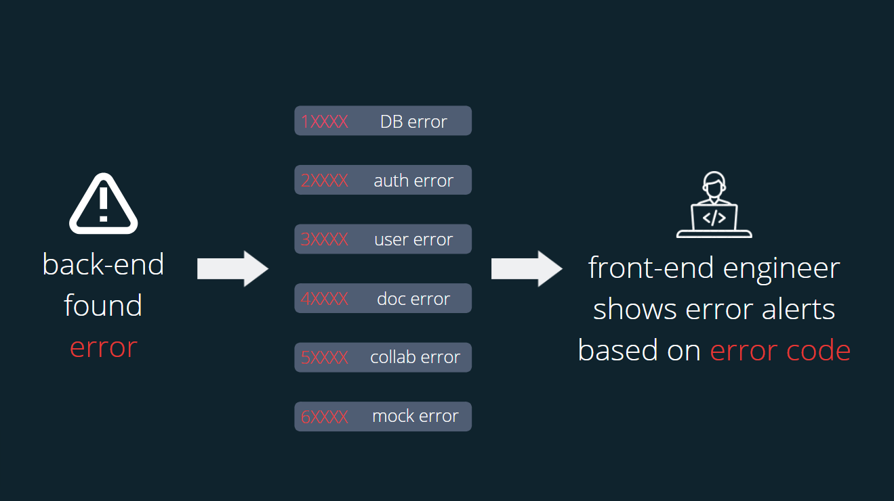

<!-- PROJECT LOGO -->
 
<h1 align="left">DocuBloom</h1>

## [About](#about) | [Getting Started](#getting-started) | [Features](#features) | [Structure](#structure) | [Budget](#budget) | [Built With](#built-with) | [Contact](#contact)

 

<!-- ABOUT -->
## About

A website for developers to build readable, sharable, and testable API documents, and to receive mock response even if the user's own server went down.

<a href="#top">back to top</a>

<!-- Getting Started -->
## Getting Started

- Get Your First API Document

- Sign In/Up to See your Profile

  Account       | Password | 
  :------------:|:--------:|
  sean@sean.com | sean     |

  

<a href="#top">back to top</a>

<!-- Features -->
## Features

- Mistype Hint

  

- API Tests

  

- Mock Response

  If a developer's server went down, s/he can still fetch mock response and past the generated urls to their codes, and the development won't be interrupted.

  

- Collaborator Management

  
  
  

  [Details](./readme/data/doc_collaboration.md)

<a href="#top">back to top</a>

<!-- Structure -->
## Structure

- Structure

  

- Error Handling Method

  

  [Details](./readme/data/responses.md)

<a href="#top">back to top</a>

<!-- Budget -->
## Budget

- The current budget is less than 15 USD per month, with equipments able to handle 500 requests per second.

- From the perspective of site traffic, it requires better equipments if the current usage grows 60-100 times larger.

- From the perspective of database, it requires more storage as the current usage grows about 3-4 times larger.

  [Details](./readme/data/budget.md)

<a href="#top">back to top</a>

## Built With

<table>
  <tbody>
    <tr>
      <th text-align="center">Back-End</th>
      <th>Cloud-Service</th>
      <th>Front-End</th>
      <th>Tools</th>
    </tr>
    <tr>
      <td style="vertical-align:top">
        <li><a href="https://nodejs.org/en/">Node.js</a></li>
        <li><a href="https://expressjs.com/">Express.js</a></li>
        <li><a href="https://www.mongodb.com/">MongoDB</a></li>
        <li><a href="https://redis.io/">Redis</a></li>
        <li><a href="https://www.docker.com/">Docker</a></li>
        <li><a href="https://www.nginx.com/">Nginx</a></li>
      </td>
      <td style="vertical-align:top">
        <li><a href="https://aws.amazon.com/ec2/">Amazon EC2</a></li>
        <li><a href="https://aws.amazon.com/s3/">Amazon S3</a></li>
        <li><a href="https://aws.amazon.com/cloudfront/">Amazon CloudFront</a></li>
        <li><a href="https://aws.amazon.com/cloudwatch/">Amazon CloudWatch</a></li>
        <li><a href="https://aws.amazon.com/elasticache/">Amazon ElastiCache</a></li>
        <li><a href="https://aws.amazon.com/elasticloadbalancing/">Elastic Load Balancing</a></li>
        <li><a href="https://aws.amazon.com/autoscaling/">AWS Auto Scaling</a></li>
      </td>
      <td style="vertical-align:top">
        <li><a href="https://reactjs.org/">React.js</a></li>
        <li><a href="https://mui.com/">MUI</a></li>
        <li>HTML5</li>
        <li>CSS3</li>
        <li>JavaScript</li>
      </td>
      <td style="vertical-align:top">
        <li>Git, GitHub</li>
        <li><a href="https://swagger.io/tools/swaggerhub/">Swagger</a></li>
        <li><a href="https://k6.io/">K6</a></li>
        <li><a href="https://www.postman.com/">Postman</a></li>
        <li><a href="https://mochajs.org/">Mocha</a></li>
        <li><a href="https://www.chaijs.com/">Chai</a></li>
      </td>
    </tr>
  </tbody>
</table>

<a href="#top">back to top</a>

## Contact

- Author: Sean Ia̍p (Iàp Sîng Gān) (葉承彥)
- Email: iapsinggan@gmail.com