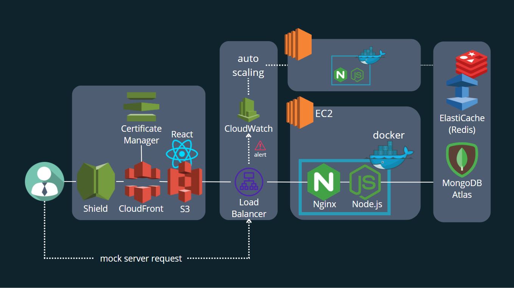
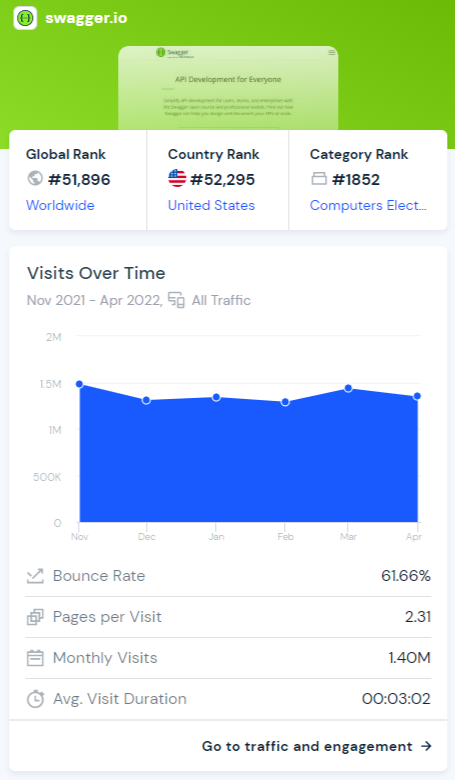

<!-- PROJECT LOGO -->
 
<h1 align="left">DocuBloom</h1>

## [About The Project](#about-the-project) | [Getting Started](#getting-started) | [Features](#features) | [Structure](#structure) | [Budget](#budget) 

<!-- TODO: delete this part -->
<!-- TABLE OF CONTENTS -->

  
Table of Contents

  <ol>
    <li>
      <a href="#about-the-project">About The Project</a>
      <ul>
        <li><a href="#built-with">Built With</a></li>
      </ul>
    </li>
    <li>
      <a href="#getting-started">Getting Started</a>
      <ul>
        <li><a href="#get-your-first-api-document">Get Your First API Document</a></li>
        <li><a href="#sign-in/up-to-see-your-profile">Sign In/Up to See your Profile</a></li>
      </ul>
    </li>
    <li>
      <a href="#features">Features</a>
      <ol>
        <li>
          <a href="#documentation">Documentation</a>
          <ul>
            <li><a href="#get-document">Get Document</a></li>
            <li><a href="#document-contents">Document Contents</a></li>
            <li><a href="#mistype-hint">Mistype Hint</a></li>
          </ul>
        </li>
        <li>
          <a href="#documentation">API Management</a>
          <ul>
            <li><a href="#api-tests">API Tests</a></li>
            <li><a href="#mock-response">Mock Response</a></li>
          </ul>
        </li>
        <li>
          <a href="#document-management">Document Management</a>
          <ul>
            <li><a href="#create-a-document">Create a Document</a></li>
            <li><a href="#edit-a-document">Edit a Document</a></li>
            <li><a href="#delete-a-document">Delete a Document</a></li>
          </ul>
        </li>
        <li>
          <a href="#collaborator-management">Collaborator Management</a>
          <ul>
            <li><a href="#add-a-collaborator">Add a Collaborator</a></li>
            <li><a href="#update-a-collaborator’s-role">Update a Collaborator’s Role</a></li>
            <li><a href="#remove-a-collaborator">Remove a Collaborator</a></li>
            <li><a href="#leave-a-document">Leave a Document</a></li>
          </ul>
        </li>
      </ol>
    </li>
    <li><a href="#structure">Structure</a></li>
    <li>
      <a href="#budget-prediction">Budget Prediction</a>
      <ul>
        <li><a href="#current-budget-calculation">Current Budget Calculation</a></li>
        <li><a href="#performance-tests-result">Performance Tests Result</a></li>
        <li><a href="#conclusion">Conclusion</a></li>
      </ul>
    </li>
    <li><a href="#error-handling-method">Error Handling Method</a></li>
    <li><a href="#mvcs-structure">MVCS Structure</a></li>
    <li><a href="#api-reference">API Reference</a></li>
    <li><a href="#roadmap">Roadmap</a></li>
    <li><a href="#license">License</a></li>
    <li><a href="#contact">Contact</a></li>
    <li><a href="#acknowledgments">Acknowledgments</a></li>
  </ol>

<!-- ABOUT THE PROJECT -->
 

## About The Project
---

It has never been easier to build and manage API documents with DocuBloom!

DocuBloom allows you to
* Build readable, sharable, and testable API documents
* Receive mock response even if your own server went down

(<a href="#top">back to top</a>)

<!-- Getting Started -->
## Getting Started
---

- Get Your First API Document

- Sign In/Up to See your Profile

  Account       | Password | 
  :-------------|:---------|
  sean@sean.com | sean     |

  

(<a href="#top">back to top</a>)

<!-- Features -->
## Features
---

- Mistype Hint

  

- API Tests

  

- Collaborator Management
  

    
    
  

  
  

  [Details](#collaborator-management-rules)

(<a href="#top">back to top</a>)

<!-- Structure -->
## Structure
---

- Structure

  

- Error Handling Method

  

<!-- Budget -->
## Budget
---

 

### Site Traffic

- Swagger
  Visits     | Bounce rate | Requests | Peak Requests |
  :---------:|:-----------:|:--------:|:-------------:|
  1.4M/month | 61.66%      | 0.08/sec | 8/sec         |

  

- With the existing budget, equipment can handle 500 requests per second.
- The server will automatically scale out in case the CPU usage is greater than 50%.

### Built With
---
<ul>
  <li>
    Back-End
    <ul>
      <li><a href="https://nodejs.org/en/">Node.js</a></li>
      <li><a href="https://expressjs.com/">Express.js</a></li>
      <li><a href="https://www.mongodb.com/">MongoDB</a></li>
      <li><a href="https://redis.io/">Redis</a></li>
      <li><a href="https://www.docker.com/">Docker</a></li>
      <li><a href="https://www.nginx.com/">Nginx</a></li>
    </ul>
  </li>
  <li>
    Cloud-Service
    <ul>
      <li><a href="https://aws.amazon.com/ec2/">Amazon EC2</a></li>
      <li><a href="https://aws.amazon.com/s3/">Amazon S3</a></li>
      <li><a href="https://aws.amazon.com/cloudfront/">Amazon CloudFront</a></li>
      <li><a href="https://aws.amazon.com/cloudwatch/">Amazon CloudWatch</a></li>
      <li><a href="https://aws.amazon.com/elasticache/">Amazon ElastiCache</a></li>
      <li><a href="https://aws.amazon.com/elasticloadbalancing/">Elastic Load Balancing</a></li>
      <li><a href="https://aws.amazon.com/autoscaling/">AWS Auto Scaling</a></li>
    </ul>
  </li>
  <li>
    Front-End
    <ul>
      <li><a href="https://reactjs.org/">React.js</a></li>
      <li><a href="https://mui.com/">MUI</a></li>
      <li>HTML5</li>
      <li>CSS3</li>
      <li>JavaScript</li>
    </ul>
  </li>
  <li>
    Tools
    <ul>
      <li>Git, GitHub</li>
      <li><a href="https://swagger.io/tools/swaggerhub/">Swagger</a></li>
      <li><a href="https://k6.io/">K6</a></li>
      <li><a href="https://www.postman.com/">Postman</a></li>
      <li><a href="https://mochajs.org/">Mocha</a></li>
      <li><a href="https://www.chaijs.com/">Chai</a></li>
    </ul>
  </li>
</ul>

### Collaborator Management Rules
---
- There are owner, editor, and viewer roles in DocuBloom. Collaborator management depends on these three roles. Just give it a try on the site if you don't want to read these complicated rules XD.
1. You will be the owner right after creating a new document.
2. An owner can change others' role to an owner, editor, or viewer.
3. An owner can see other collaborators of the document.
4. An owner can remove any collaborator instead of another owner.
5. An owner can remove, edit, and view the document.
6. An owner cannot leave a document or be removed by others.
7. A document must have at least one owner.
8. An editor can change others' role to an editor, or viewer.
9. An editor can see other collaborators of the document.
10. An editor can edit and view the document.
11. An editor can leave the document.
12. A viewer can view the document.
13. A viewer can leave the document.
14. A viewer can see other collaborators of the document.
- If you are the owner of a document and you want to remove another owner. You will need to change his role to an editor or view, and then remove him.
- If you are the owner of a document and you want to leave this document. You need make sure there is at least another one as an owner, change your own role to an editor or viewer, and then click the leave document button.

1. Add a Collaborator

2. Update a Collaborator’s Role

3. Remove a Collaborator

4. Leave a Document

