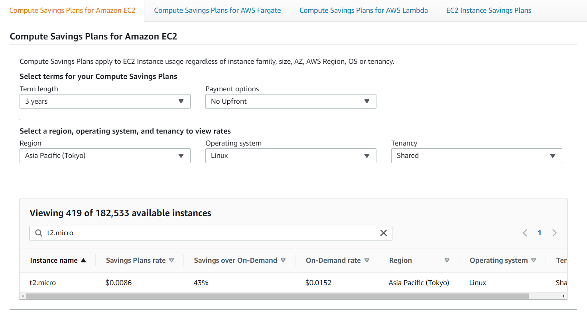
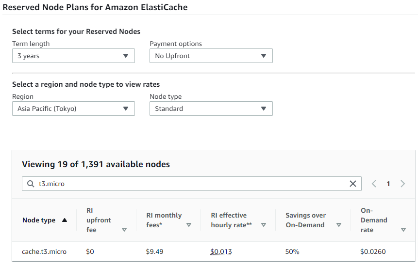
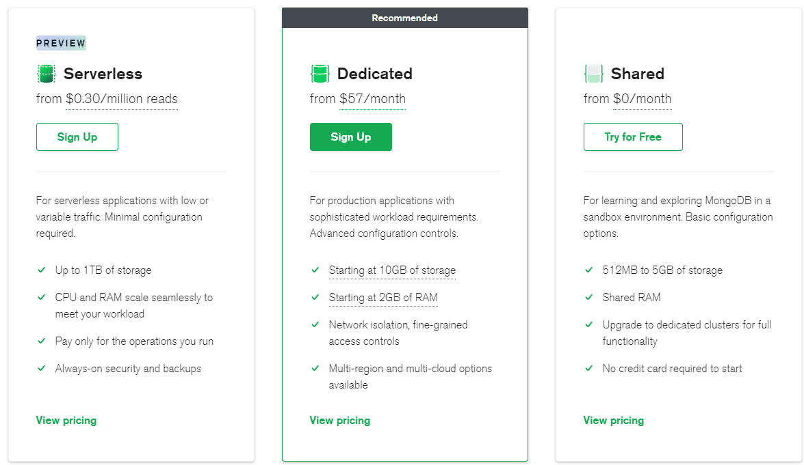
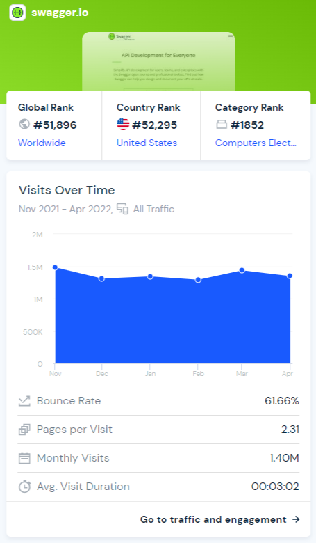

# Budget

## Current Equipments Pricing

|              | level          | rate                |
|:------------:|:--------------:|:-------------------:|
|EC2           | t2.micro       | 6.282 USD per month |
|ElastiCache   | cache.t3.micro | 9.496 USD per month |
|MongoDB Atlas | Shared         | free                |

  
EC2

  - I chose the 3-year Savings Plan (a commitment for 3 years) for a 43% saving over the On-Demand Plan.

    

  
ElastiCache

  - I chose the 3-year Reserved Node (a commitment for 3 years) for a 50% saving over the On-Demand Node.

    

  
MongoDB

  - I chose the free plan.

    

## Site Traffic (in comparison with Swagger)

Visits     | Bounce rate | Requests | Peak Requests |
:---------:|:-----------:|:--------:|:-------------:|
1.4M/month | 61.66%      | 0.08/sec | 8/sec         |

- The Peak Requests is estimated to be 100 times higher than the typical one, which must be checked on a regular basis in production. 

- The site traffic data came from [Similarweb](https://www.similarweb.com/zh-tw/).

  
Data Details

  

## Performance Test Result (with [k6](https://k6.io/) on the Mock Response API)

- Peak Situation: The server can easily handle such traffic.

- Limit Situation: The server can handle around 800 requests per second for about 10 minutes.

- Auto-Scaling Test: The server will scale out while the CPU usage is grater than 50%.

- [Details](./performance_test.md)

## Database Usage Calculation

- The MongoDB free plan provides 512MB to 5GB storage
- The storage per document and per user is
  |         | storage | 
  |:-------:|:-------:|
  |document | 15kb    |
  |user info| 2kb     |
- Consider 3 people with 5 documents a group
  |                  | storage per group | can store |
  |:----------------:|:-----------------:|:---------:|
  |3 people + 5 docu | 81kb              | 61728     |

## Conclusion

- From the perspective of site traffic, it requires better equipments if the request rate is greater than 500-800 per second.

- From the perspective of database, it requires more storage when there are about 180k users. 