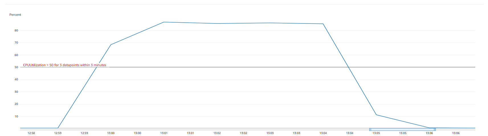
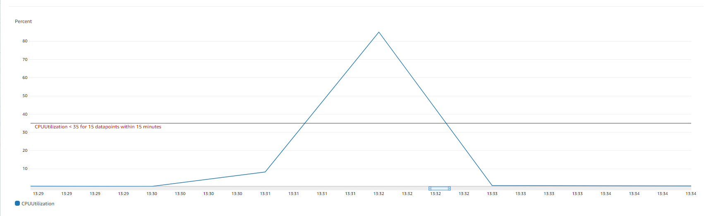
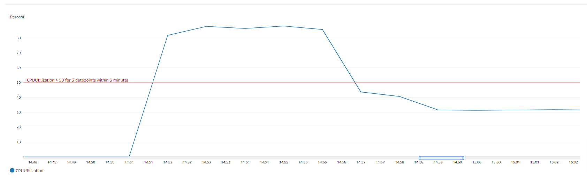
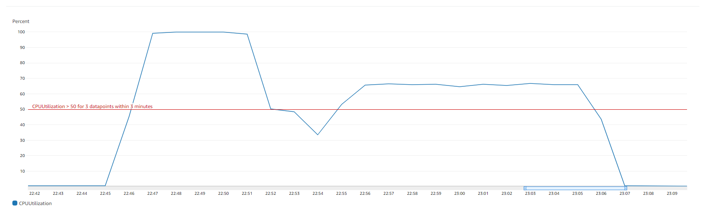
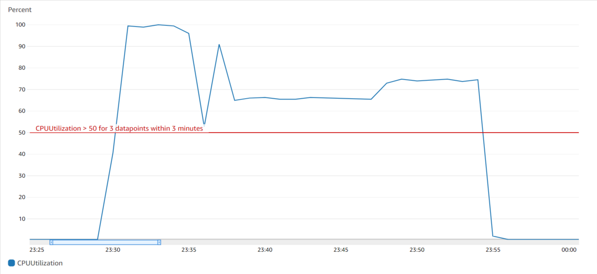
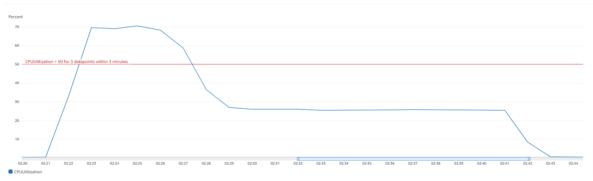
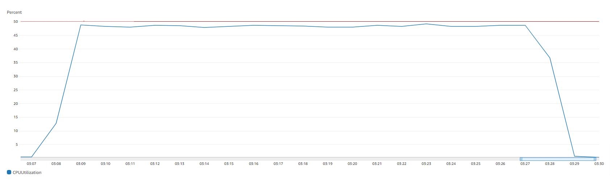
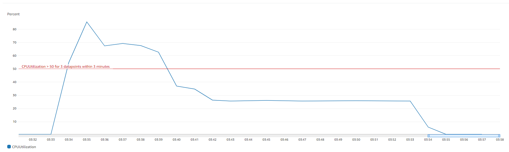

# Performace Test Results with K6
## [Peak Situation](#peak-situation) | [Limit Situation](#limit-situation) | [Auto Scaling Test](#auto-scaling-test) 

<br />

## Peak Situation
<details>
  <summary>K6 configuration</summary>

  - 8 requests per second for 10 minutes. Required correct response in 5 seconds.

  ```js
  import http from 'k6/http';
  import { check, group, sleep } from 'k6';

  export const options = {
    discardResponseBodies: true,
    insecureSkipTLSVerify: true, // for https://<IP address>
    scenarios: {
        contacts: {
            executor: 'constant-arrival-rate',
            rate: 1,
            duration: '10m',
            preAllocatedVUs: 100,
            // maxVUs: 100,
        },
    },
  };

  export default function () {
    const responses = http.batch([
      ['GET', 'https://api.vivaformosean.com/api/1.0/mock-server/docs/627b69a94c0ebe5c860d3443/examples?path=/api/1.0/admin/analysis/sales&method=get&statusCode=200&contentType=application/json&exampleName=sample1'],
      ['GET', 'https://api.vivaformosean.com/api/1.0/mock-server/docs/627b69a94c0ebe5c860d3443/examples?path=/api/1.0/admin/analysis/user_consumption&method=get&statusCode=200&contentType=application/json&exampleName=sample1'],
      ['GET', 'https://api.vivaformosean.com/api/1.0/mock-server/docs/627b69a94c0ebe5c860d3443/examples?path=/api/1.0/admin/analysis/signup_number&method=get&statusCode=200&contentType=application/json&exampleName=sample1'],
      ['GET', 'https://api.vivaformosean.com/api/1.0/mock-server/docs/627b69a94c0ebe5c860d3443/examples?path=/api/1.0/admin/coupons&method=get&statusCode=200&contentType=application/json&exampleName=sample1'],
      ['GET', 'https://api.vivaformosean.com/api/1.0/mock-server/docs/627b69a94c0ebe5c860d3443/examples?path=/api/1.0/admin/coupons&method=post&statusCode=200&contentType=application/json&exampleName=sample1'],
      ['GET', 'https://api.vivaformosean.com/api/1.0/mock-server/docs/627b69a94c0ebe5c860d3443/examples?path=/api/1.0/admin/coupons&method=delete&statusCode=200&contentType=application/json&exampleName=sample1'],
      ['GET', 'https://api.vivaformosean.com/api/1.0/mock-server/docs/627b69a94c0ebe5c860d3443/examples?path=/api/1.0/admin/coupons&method=delete&statusCode=200&contentType=application/json&exampleName=sample1'],
      ['GET', 'https://api.vivaformosean.com/api/1.0/mock-server/docs/627b69a94c0ebe5c860d3443/examples?path=/api/1.0/admin/products&method=put&statusCode=200&contentType=application/json&exampleName=sample1'],
    ]);
    for (let i = 0; i < responses.length; i++) {
      check(responses[i], {
        'mock response status was 200': (r) => r.status == 200,
        'mock response time was < 5000ms': (r) => r.timings.duration < 5000,
      })
    }
  }

  export function handleSummary(data) {
    return {
      './test.json': JSON.stringify(data, null, 2),
    }
  }
  ```

</details>

<details>
  <summary>1st result</summary>

  ```json
  {
  "metrics": {
    "iteration_duration": {
      "type": "trend",
      "contains": "time",
      "values": {
        "p(90)": 18.228705,
        "p(95)": 21.45591,
        "avg": 15.962618903494175,
        "min": 13.390501,
        "med": 14.963397,
        "max": 69.27285
      }
    },
    "http_req_sending": {
      "type": "trend",
      "contains": "time",
      "values": {
        "min": 0.014095,
        "med": 0.038086499999999995,
        "max": 3.964588,
        "p(90)": 0.06259160000000001,
        "p(95)": 0.07210474999999997,
        "avg": 0.04161020153910147
      }
    },
    "data_received": {
      "values": {
        "count": 16370431,
        "rate": 27283.27226933835
      },
      "type": "counter",
      "contains": "data"
    },
    "http_req_duration{expected_response:true}": {
      "type": "trend",
      "contains": "time",
      "values": {
        "p(90)": 7.9788362,
        "p(95)": 9.3809562,
        "avg": 6.22318793386024,
        "min": 2.273689,
        "med": 5.8782785,
        "max": 40.470823
      }
    },
    "iterations": {
      "contains": "default",
      "values": {
        "count": 601,
        "rate": 1.0016380530159743
      },
      "type": "counter"
    },
    "http_req_blocked": {
      "type": "trend",
      "contains": "time",
      "values": {
        "avg": 0.44507579430116445,
        "min": 0.001265,
        "med": 0.001503,
        "max": 35.667332,
        "p(90)": 2.9466870000000003,
        "p(95)": 3.3520030999999983
      }
    },
    "http_req_tls_handshaking": {
      "type": "trend",
      "contains": "time",
      "values": {
        "avg": 0.2675625482529117,
        "min": 0,
        "med": 0,
        "max": 10.547578,
        "p(90)": 1.1183165000000002,
        "p(95)": 2.5452423499999983
      }
    },
    "http_req_waiting": {
      "type": "trend",
      "contains": "time",
      "values": {
        "max": 40.392535,
        "p(90)": 7.7718412,
        "p(95)": 8.832534749999994,
        "avg": 6.107077654534093,
        "min": 2.209208,
        "med": 5.78495
      }
    },
    "http_req_duration": {
      "type": "trend",
      "contains": "time",
      "values": {
        "avg": 6.22318793386024,
        "min": 2.273689,
        "med": 5.8782785,
        "max": 40.470823,
        "p(90)": 7.9788362,
        "p(95)": 9.3809562
      }
    },
    "http_req_receiving": {
      "type": "trend",
      "contains": "time",
      "values": {
        "min": 0.018669,
        "med": 0.030915,
        "max": 4.344808,
        "p(90)": 0.08354610000000001,
        "p(95)": 0.15784334999999994,
        "avg": 0.07450007778702146
      }
    },
    "vus": {
      "contains": "default",
      "values": {
        "min": 100,
        "max": 100,
        "value": 100
      },
      "type": "gauge"
    },
    "http_reqs": {
      "type": "counter",
      "contains": "default",
      "values": {
        "count": 4808,
        "rate": 8.013104424127794
      }
    },
    "checks": {
      "type": "rate",
      "contains": "default",
      "values": {
        "rate": 1,
        "passes": 9616,
        "fails": 0
      }
    },
    "vus_max": {
      "type": "gauge",
      "contains": "default",
      "values": {
        "value": 100,
        "min": 100,
        "max": 100
      }
    },
    "http_req_failed": {
      "values": {
        "rate": 0,
        "passes": 0,
        "fails": 4808
      },
      "type": "rate",
      "contains": "default"
    },
    "data_sent": {
      "type": "counter",
      "contains": "data",
      "values": {
        "count": 2422654,
        "rate": 4037.6413239456942
      }
    },
    "http_req_connecting": {
      "type": "trend",
      "contains": "time",
      "values": {
        "avg": 0.1671420971297838,
        "min": 0,
        "med": 0,
        "max": 25.073766,
        "p(90)": 0.4335905000000002,
        "p(95)": 1.7327544499999998
      }
    }
  },
  "root_group": {
    "name": "",
    "path": "",
    "id": "d41d8cd98f00b204e9800998ecf8427e",
    "groups": [],
    "checks": [
        {
          "fails": 0,
          "name": "mock response status was 200",
          "path": "::mock response status was 200",
          "id": "93485a90ec0de70bee58343121ffc76d",
          "passes": 4808
        },
        {
          "name": "mock response time was < 5000ms",
          "path": "::mock response time was < 5000ms",
          "id": "b03c1e0fddc985148b53ab7a72484f91",
          "passes": 4808,
          "fails": 0
        }
      ]
  },
  "options": {
    "noColor": false,
    "summaryTrendStats": [
      "avg",
      "min",
      "med",
      "max",
      "p(90)",
      "p(95)"
    ],
    "summaryTimeUnit": ""
  },
  "state": {
    "isStdOutTTY": true,
    "isStdErrTTY": true,
    "testRunDurationMs": 600017.140114
  }
}
  ```

</details>

<details>
  <summary>2nd result</summary>

  ```json
  {
    "state": {
      "testRunDurationMs": 600017.489091,
      "isStdOutTTY": true,
      "isStdErrTTY": true
    },
    "metrics": {
      "checks": {
        "contains": "default",
        "values": {
          "rate": 1,
          "passes": 9616,
          "fails": 0
        },
        "type": "rate"
      },
      "data_sent": {
        "values": {
          "rate": 4039.0955998158283,
          "count": 2423528
        },
        "type": "counter",
        "contains": "data"
      },
      "http_req_receiving": {
        "type": "trend",
        "contains": "time",
        "values": {
          "p(95)": 0.13808999999999996,
          "avg": 0.06297361376871886,
          "min": 0.017463,
          "med": 0.031233999999999998,
          "max": 6.638919,
          "p(90)": 0.0874554
        }
      },
      "vus_max": {
        "type": "gauge",
        "contains": "default",
        "values": {
          "value": 100,
          "min": 100,
          "max": 100
        }
      },
      "iterations": {
        "type": "counter",
        "contains": "default",
        "values": {
          "count": 601,
          "rate": 1.0016374704518838
        }
      },
      "http_req_blocked": {
        "type": "trend",
        "contains": "time",
        "values": {
          "min": 0.0012,
          "med": 0.001491,
          "max": 13.006808,
          "p(90)": 2.9267507000000004,
          "p(95)": 3.34827335,
          "avg": 0.4378586776206326
        }
      },
      "http_req_connecting": {
        "type": "trend",
        "contains": "time",
        "values": {
          "med": 0,
          "max": 6.099081,
          "p(90)": 0.4366201,
          "p(95)": 1.7596859999999996,
          "avg": 0.16849367304492516,
          "min": 0
        }
      },
      "vus": {
        "contains": "default",
        "values": {
          "value": 100,
          "min": 100,
          "max": 100
        },
        "type": "gauge"
      },
      "http_req_failed": {
        "type": "rate",
        "contains": "default",
        "values": {
          "fails": 4808,
          "rate": 0,
          "passes": 0
        }
      },
      "http_req_tls_handshaking": {
        "type": "trend",
        "contains": "time",
        "values": {
          "med": 0,
          "max": 10.988382,
          "p(90)": 1.0712417,
          "p(95)": 2.472396799999998,
          "avg": 0.25867307986688864,
          "min": 0
        }
      },
      "data_received": {
        "type": "counter",
        "contains": "data",
        "values": {
          "rate": 27288.522914232493,
          "count": 16373591
        }
      },
      "iteration_duration": {
        "contains": "time",
        "values": {
          "avg": 15.767933257903483,
          "min": 13.328112,
          "med": 14.897267,
          "max": 49.165668,
          "p(90)": 17.754643,
          "p(95)": 20.828021
        },
        "type": "trend"
      },
      "http_reqs": {
        "type": "counter",
        "contains": "default",
        "values": {
          "count": 4808,
          "rate": 8.01309976361507
        }
      },
      "http_req_duration": {
        "contains": "time",
        "values": {
          "max": 33.378625,
          "p(90)": 7.905892800000002,
          "p(95)": 9.561421299999996,
          "avg": 6.228853078202986,
          "min": 2.263376,
          "med": 5.8006765
        },
        "type": "trend"
      },
      "http_req_sending": {
        "contains": "time",
        "values": {
          "p(95)": 0.06916759999999998,
          "avg": 0.03922740599001666,
          "min": 0.01374,
          "med": 0.0363045,
          "max": 0.828557,
          "p(90)": 0.0608292
        },
        "type": "trend"
      },
      "http_req_waiting": {
        "type": "trend",
        "contains": "time",
        "values": {
          "avg": 6.126652058444253,
          "min": 2.196694,
          "med": 5.6941685,
          "max": 33.33078,
          "p(90)": 7.7438767,
          "p(95)": 9.3518315
        }
      },
      "http_req_duration{expected_response:true}": {
        "type": "trend",
        "contains": "time",
        "values": {
          "avg": 6.228853078202986,
          "min": 2.263376,
          "med": 5.8006765,
          "max": 33.378625,
          "p(90)": 7.905892800000002,
          "p(95)": 9.561421299999996
        }
      }
    },
    "root_group": {
      "path": "",
      "id": "d41d8cd98f00b204e9800998ecf8427e",
      "groups": [],
      "checks": [
          {
            "name": "mock response status was 200",
            "path": "::mock response status was 200",
            "id": "93485a90ec0de70bee58343121ffc76d",
            "passes": 4808,
            "fails": 0
          },
          {
            "id": "b03c1e0fddc985148b53ab7a72484f91",
            "passes": 4808,
            "fails": 0,
            "name": "mock response time was < 5000ms",
            "path": "::mock response time was < 5000ms"
          }
        ],
      "name": ""
    },
    "options": {
      "summaryTrendStats": [
        "avg",
        "min",
        "med",
        "max",
        "p(90)",
        "p(95)"
      ],
      "summaryTimeUnit": "",
      "noColor": false
    }
  }
  ```

</details>

<details>
  <summary>3rd result</summary>

  ```json
  {
    "state": {
      "isStdOutTTY": true,
      "isStdErrTTY": true,
      "testRunDurationMs": 600017.285887
    },
    "metrics": {
      "data_sent": {
        "contains": "data",
        "values": {
          "rate": 4042.3035419962557,
          "count": 2425452
        },
        "type": "counter"
      },
      "http_req_blocked": {
        "values": {
          "p(90)": 2.9187116000000004,
          "p(95)": 3.2845373999999996,
          "avg": 0.45795913539933547,
          "min": 0.001281,
          "med": 0.0015,
          "max": 76.730641
        },
        "type": "trend",
        "contains": "time"
      },
      "data_received": {
        "type": "counter",
        "contains": "data",
        "values": {
          "count": 16386146,
          "rate": 27309.456553033324
        }
      },
      "http_req_duration{expected_response:true}": {
        "type": "trend",
        "contains": "time",
        "values": {
          "med": 6.1687775,
          "max": 115.300603,
          "p(90)": 8.8805181,
          "p(95)": 11.188551849999994,
          "avg": 6.870617950707151,
          "min": 2.385536
        }
      },
      "http_req_waiting": {
        "values": {
          "avg": 6.775422534525779,
          "min": 2.292286,
          "med": 6.0790735,
          "max": 115.192726,
          "p(90)": 8.6936501,
          "p(95)": 11.111515899999999
        },
        "type": "trend",
        "contains": "time"
      },
      "iteration_duration": {
        "type": "trend",
        "contains": "time",
        "values": {
          "avg": 17.336533405990032,
          "min": 13.628117,
          "med": 15.583286,
          "max": 194.958034,
          "p(90)": 20.345452,
          "p(95)": 23.700935
        }
      },
      "iterations": {
        "type": "counter",
        "contains": "default",
        "values": {
          "count": 601,
          "rate": 1.001637809670012
        }
      },
      "http_req_tls_handshaking": {
        "type": "trend",
        "contains": "time",
        "values": {
          "avg": 0.26129965869384353,
          "min": 0,
          "med": 0,
          "max": 24.471017,
          "p(90)": 1.0873154000000018,
          "p(95)": 2.47108125
        }
      },
      "vus_max": {
        "type": "gauge",
        "contains": "default",
        "values": {
          "value": 100,
          "min": 100,
          "max": 100
        }
      },
      "checks": {
        "type": "rate",
        "contains": "default",
        "values": {
          "rate": 1,
          "passes": 9616,
          "fails": 0
        }
      },
      "http_req_sending": {
        "type": "trend",
        "contains": "time",
        "values": {
          "p(90)": 0.062903,
          "p(95)": 0.07175964999999992,
          "avg": 0.04045517782861896,
          "min": 0.014476,
          "med": 0.037732,
          "max": 0.436633
        }
      },
      "vus": {
        "type": "gauge",
        "contains": "default",
        "values": {
          "value": 100,
          "min": 100,
          "max": 100
        }
      },
      "http_reqs": {
        "type": "counter",
        "contains": "default",
        "values": {
          "rate": 8.013102477360096,
          "count": 4808
        }
      },
      "http_req_connecting": {
        "type": "trend",
        "contains": "time",
        "values": {
          "avg": 0.1716574542429283,
          "min": 0,
          "med": 0,
          "max": 21.903557,
          "p(90)": 0.43383920000000015,
          "p(95)": 1.7256025999999998
        }
      },
      "http_req_duration": {
        "type": "trend",
        "contains": "time",
        "values": {
          "min": 2.385536,
          "med": 6.1687775,
          "max": 115.300603,
          "p(90)": 8.8805181,
          "p(95)": 11.188551849999994,
          "avg": 6.870617950707151
        }
      },
      "http_req_failed": {
        "values": {
          "rate": 0,
          "passes": 0,
          "fails": 4808
        },
        "type": "rate",
        "contains": "default"
      },
      "http_req_receiving": {
        "type": "trend",
        "contains": "time",
        "values": {
          "avg": 0.05474023835274535,
          "min": 0.018013,
          "med": 0.030926500000000003,
          "max": 2.588182,
          "p(90)": 0.08034270000000002,
          "p(95)": 0.1271513999999998
        }
      }
    },
    "root_group": {
      "name": "",
      "path": "",
      "id": "d41d8cd98f00b204e9800998ecf8427e",
      "groups": [],
      "checks": [
          {
            "id": "93485a90ec0de70bee58343121ffc76d",
            "passes": 4808,
            "fails": 0,
            "name": "mock response status was 200",
            "path": "::mock response status was 200"
          },
          {
            "name": "mock response time was < 5000ms",
            "path": "::mock response time was < 5000ms",
            "id": "b03c1e0fddc985148b53ab7a72484f91",
            "passes": 4808,
            "fails": 0
          }
        ]
    },
    "options": {
      "summaryTrendStats": [
        "avg",
        "min",
        "med",
        "max",
        "p(90)",
        "p(95)"
      ],
      "summaryTimeUnit": "",
      "noColor": false
    }
  }
  ```

</details>

<br />

## Limit Situation (CPU > 95%, with some reponses taking longer than 5 seconds)
<details>
  <summary>K6 configuration</summary>

  ```js
  import http from 'k6/http';
  import { check, group, sleep } from 'k6';

  export const options = {
    discardResponseBodies: true,
    scenarios: {
        contacts: {
            executor: 'constant-arrival-rate',
            rate: 1000, //the rate will change based on different test cases
            duration: '1m', //the rate will change based on different duration cases
            preAllocatedVUs: 3000,
        },
    },
  };

  const SLEEP_DURATION = 0.1;
  const params = {
    headers: {
        'Content-Type': 'application/json',
    },
  };
  const url = 'https://api.vivaformosean.com/api/1.0/mock-server/docs/627b69a94c0ebe5c860d3443/examples?path=/api/1.0/admin/analysis/sales&method=get&statusCode=200&contentType=application/json&exampleName=sample1'

  const validStatusCode = url.substring(url.indexOf('statusCode=') + 11, url.indexOf('&contentType'));

  export default function () {
    const res = http.get(url, params);
    check(res, {
        [`status was ${validStatusCode}`]: (r) => r.status == validStatusCode,
        'mock response time was < 5000ms': (r) => r.timings.duration < 5000,
    });
    sleep(SLEEP_DURATION);
  }

  export function handleSummary(data) {
    return {
      './test.json': JSON.stringify(data, null, 2),
    }
  }
  ```

</details>

<details>
  <summary>rate 1100, duration 10s (2 request senders)</summary>

  ```json
  {
    "root_group": {
      "name": "",
      "path": "",
      "id": "d41d8cd98f00b204e9800998ecf8427e",
      "groups": [],
      "checks": [
          {
            "passes": 5501,
            "fails": 0,
            "name": "status was 200",
            "path": "::status was 200",
            "id": "1461660757a913d4fb82ac4c5e1009de"
          },
          {
            "passes": 5349,
            "fails": 152,
            "name": "mock response time was < 5000ms",
            "path": "::mock response time was < 5000ms",
            "id": "b03c1e0fddc985148b53ab7a72484f91"
          }
        ]
    },
    "options": {
      "summaryTrendStats": [
        "avg",
        "min",
        "med",
        "max",
        "p(90)",
        "p(95)"
      ],
      "summaryTimeUnit": "",
      "noColor": false
    },
    "state": {
      "isStdOutTTY": true,
      "isStdErrTTY": true,
      "testRunDurationMs": 19605.878041
    },
    "metrics": {
      "http_req_duration": {
        "type": "trend",
        "contains": "time",
        "values": {
          "avg": 1208.9441502504963,
          "min": 2.405081,
          "med": 617.225525,
          "max": 15501.690527,
          "p(90)": 3202.995781,
          "p(95)": 3653.850093
        }
      },
      "http_reqs": {
        "type": "counter",
        "contains": "default",
        "values": {
          "count": 5501,
          "rate": 280.579119613835
        }
      },
      "http_req_blocked": {
        "values": {
          "p(90)": 9.752351,
          "p(95)": 75.734185,
          "avg": 10.780592594800954,
          "min": 0.00249,
          "med": 0.002898,
          "max": 240.87791
        },
        "type": "trend",
        "contains": "time"
      },
      "http_req_waiting": {
        "type": "trend",
        "contains": "time",
        "values": {
          "min": 2.07457,
          "med": 617.053429,
          "max": 15501.580883,
          "p(90)": 3202.921458,
          "p(95)": 3652.918909,
          "avg": 1207.967828363753
        }
      },
      "http_req_receiving": {
        "type": "trend",
        "contains": "time",
        "values": {
          "p(95)": 4.267739,
          "avg": 0.8290961706962412,
          "min": 0.0195,
          "med": 0.059425,
          "max": 36.114839,
          "p(90)": 1.066422
        }
      },
      "data_sent": {
        "type": "counter",
        "contains": "data",
        "values": {
          "rate": 85690.83192737789,
          "count": 1680044
        }
      },
      "data_received": {
        "values": {
          "count": 10264363,
          "rate": 523534.9816282171
        },
        "type": "counter",
        "contains": "data"
      },
      "http_req_tls_handshaking": {
        "type": "trend",
        "contains": "time",
        "values": {
          "med": 0,
          "max": 185.624769,
          "p(90)": 7.36751,
          "p(95)": 45.126334,
          "avg": 7.255032611706964,
          "min": 0
        }
      },
      "http_req_duration{expected_response:true}": {
        "contains": "time",
        "values": {
          "p(95)": 3653.850093,
          "avg": 1208.9441502504963,
          "min": 2.405081,
          "med": 617.225525,
          "max": 15501.690527,
          "p(90)": 3202.995781
        },
        "type": "trend"
      },
      "http_req_sending": {
        "type": "trend",
        "contains": "time",
        "values": {
          "avg": 0.14722571605162713,
          "min": 0.033303,
          "med": 0.062512,
          "max": 27.853731,
          "p(90)": 0.141511,
          "p(95)": 0.165432
        }
      },
      "iterations": {
        "type": "counter",
        "contains": "default",
        "values": {
          "count": 5501,
          "rate": 280.579119613835
        }
      },
      "vus_max": {
        "type": "gauge",
        "contains": "default",
        "values": {
          "value": 2000,
          "min": 1000,
          "max": 2000
        }
      },
      "http_req_failed": {
        "contains": "default",
        "values": {
          "rate": 0,
          "passes": 0,
          "fails": 5501
        },
        "type": "rate"
      },
      "checks": {
        "type": "rate",
        "contains": "default",
        "values": {
          "passes": 10850,
          "fails": 152,
          "rate": 0.9861843301217961
        }
      },
      "http_req_connecting": {
        "type": "trend",
        "contains": "time",
        "values": {
          "min": 0,
          "med": 0,
          "max": 95.701708,
          "p(90)": 2.424263,
          "p(95)": 19.699227,
          "avg": 3.2263103830212523
        }
      },
      "iteration_duration": {
        "contains": "time",
        "values": {
          "min": 105.337973,
          "med": 719.160832,
          "max": 15606.572371,
          "p(90)": 3303.604323,
          "p(95)": 3755.58569,
          "avg": 1320.8652223023075
        },
        "type": "trend"
      },
      "vus": {
        "contains": "default",
        "values": {
          "min": 0,
          "max": 2000,
          "value": 2000
        },
        "type": "gauge"
      }
    }
  }
  ```

</details>

<details>
  <summary>rate 1000, duration 10s (2 request senders)</summary>

  ```json
  {
    "options": {
      "summaryTrendStats": [
        "avg",
        "min",
        "med",
        "max",
        "p(90)",
        "p(95)"
      ],
      "summaryTimeUnit": "",
      "noColor": false
    },
    "state": {
      "isStdErrTTY": true,
      "testRunDurationMs": 12115.288172,
      "isStdOutTTY": true
    },
    "metrics": {
      "http_req_sending": {
        "type": "trend",
        "contains": "time",
        "values": {
          "min": 0.03301,
          "med": 0.063643,
          "max": 54.44583,
          "p(90)": 0.157249,
          "p(95)": 0.188061,
          "avg": 0.22712725714857016
        }
      },
      "iterations": {
        "type": "counter",
        "contains": "default",
        "values": {
          "rate": 412.7842383112239,
          "count": 5001
        }
      },
      "http_req_duration": {
        "type": "trend",
        "contains": "time",
        "values": {
          "min": 2.176245,
          "med": 432.315348,
          "max": 7525.168442,
          "p(90)": 1443.569946,
          "p(95)": 1587.310489,
          "avg": 656.4113599806022
        }
      },
      "vus_max": {
        "type": "gauge",
        "contains": "default",
        "values": {
          "value": 2000,
          "min": 961,
          "max": 2000
        }
      },
      "http_reqs": {
        "values": {
          "count": 5001,
          "rate": 412.7842383112239
        },
        "type": "counter",
        "contains": "default"
      },
      "http_req_waiting": {
        "contains": "time",
        "values": {
          "med": 431.808758,
          "max": 7525.00204,
          "p(90)": 1443.299778,
          "p(95)": 1565.852324,
          "avg": 654.3425944305145,
          "min": 2.009016
        },
        "type": "trend"
      },
      "vus": {
        "type": "gauge",
        "contains": "default",
        "values": {
          "value": 2000,
          "min": 0,
          "max": 2000
        }
      },
      "data_sent": {
        "type": "counter",
        "contains": "data",
        "values": {
          "count": 1658044,
          "rate": 136855.51482233452
        }
      },
      "http_req_connecting": {
        "values": {
          "avg": 3.446455376924619,
          "min": 0,
          "med": 0,
          "max": 122.542537,
          "p(90)": 2.145342,
          "p(95)": 10.246557
        },
        "type": "trend",
        "contains": "time"
      },
      "http_req_duration{expected_response:true}": {
        "type": "trend",
        "contains": "time",
        "values": {
          "med": 432.315348,
          "max": 7525.168442,
          "p(90)": 1443.569946,
          "p(95)": 1587.310489,
          "avg": 656.4113599806022,
          "min": 2.176245
        }
      },
      "data_received": {
        "type": "counter",
        "contains": "data",
        "values": {
          "count": 10068363,
          "rate": 831046.1011789461
        }
      },
      "http_req_failed": {
        "type": "rate",
        "contains": "default",
        "values": {
          "rate": 0,
          "passes": 0,
          "fails": 5001
        }
      },
      "checks": {
        "values": {
          "rate": 0.9984003199360127,
          "passes": 9986,
          "fails": 16
        },
        "type": "rate",
        "contains": "default"
      },
      "iteration_duration": {
        "type": "trend",
        "contains": "time",
        "values": {
          "max": 7634.042787,
          "p(90)": 1545.312309,
          "p(95)": 1790.12393,
          "avg": 769.1465658256373,
          "min": 104.993441,
          "med": 543.824621
        }
      },
      "http_req_tls_handshaking": {
        "type": "trend",
        "contains": "time",
        "values": {
          "avg": 7.713588742451507,
          "min": 0,
          "med": 0,
          "max": 187.440989,
          "p(90)": 6.276315,
          "p(95)": 35.942765
        }
      },
      "http_req_blocked": {
        "contains": "time",
        "values": {
          "min": 0.002492,
          "med": 0.002889,
          "max": 271.443531,
          "p(90)": 8.562777,
          "p(95)": 48.686158,
          "avg": 11.451113607078605
        },
        "type": "trend"
      },
      "http_req_receiving": {
        "type": "trend",
        "contains": "time",
        "values": {
          "avg": 1.8416382929414168,
          "min": 0.019854,
          "med": 0.065681,
          "max": 57.679444,
          "p(90)": 1.485779,
          "p(95)": 9.576971
        }
      }
    },
    "root_group": {
      "path": "",
      "id": "d41d8cd98f00b204e9800998ecf8427e",
      "groups": [],
      "checks": [
          {
            "name": "status was 200",
            "path": "::status was 200",
            "id": "1461660757a913d4fb82ac4c5e1009de",
            "passes": 5001,
            "fails": 0
          },
          {
            "name": "mock response time was < 5000ms",
            "path": "::mock response time was < 5000ms",
            "id": "b03c1e0fddc985148b53ab7a72484f91",
            "passes": 4985,
            "fails": 16
          }
        ],
      "name": ""
    }
  }
  ```

</details>

<details>
  <summary>rate 1000, duration 30s (4 request senders)</summary>

  ```json
  {
    "root_group": {
      "checks": [
        {
          "path": "::status was 200",
          "id": "1461660757a913d4fb82ac4c5e1009de",
          "passes": 7501,
          "fails": 0,
          "name": "status was 200"
        },
        {
          "fails": 94,
          "name": "mock response time was < 5000ms",
          "path": "::mock response time was < 5000ms",
          "id": "b03c1e0fddc985148b53ab7a72484f91",
          "passes": 7407
        }
      ],
      "name": "",
      "path": "",
      "id": "d41d8cd98f00b204e9800998ecf8427e",
      "groups": []
    },
    "options": {
      "summaryTimeUnit": "",
      "noColor": false,
      "summaryTrendStats": [
        "avg",
        "min",
        "med",
        "max",
        "p(90)",
        "p(95)"
      ]
    },
    "state": {
      "isStdOutTTY": true,
      "isStdErrTTY": true,
      "testRunDurationMs": 34943.584276
    },
    "metrics": {
      "http_req_blocked": {
        "contains": "time",
        "values": {
          "p(90)": 7.169777,
          "p(95)": 7.856022,
          "avg": 1.7188931826423084,
          "min": 0.002491,
          "med": 0.002913,
          "max": 32.846491
        },
        "type": "trend"
      },
      "checks": {
        "type": "rate",
        "contains": "default",
        "values": {
          "rate": 0.9937341687774963,
          "passes": 14908,
          "fails": 94
        }
      },
      "data_received": {
        "type": "counter",
        "contains": "data",
        "values": {
          "count": 11048392,
          "rate": 316177.98313804547
        }
      },
      "vus": {
        "type": "gauge",
        "contains": "default",
        "values": {
          "value": 2000,
          "min": 0,
          "max": 2000
        }
      },
      "http_req_duration{expected_response:true}": {
        "type": "trend",
        "contains": "time",
        "values": {
          "med": 545.250002,
          "max": 15783.910667,
          "p(90)": 1587.752426,
          "p(95)": 3502.548694,
          "avg": 898.9982046275151,
          "min": 2.16134
        }
      },
      "http_req_failed": {
        "type": "rate",
        "contains": "default",
        "values": {
          "fails": 7501,
          "rate": 0,
          "passes": 0
        }
      },
      "iteration_duration": {
        "type": "trend",
        "contains": "time",
        "values": {
          "avg": 1001.4338040186675,
          "min": 104.879116,
          "med": 646.995692,
          "max": 15885.128066,
          "p(90)": 1688.678177,
          "p(95)": 3603.691875
        }
      },
      "http_req_duration": {
        "type": "trend",
        "contains": "time",
        "values": {
          "avg": 898.9982046275151,
          "min": 2.16134,
          "med": 545.250002,
          "max": 15783.910667,
          "p(90)": 1587.752426,
          "p(95)": 3502.548694
        }
      },
      "iterations": {
        "type": "counter",
        "contains": "default",
        "values": {
          "count": 7501,
          "rate": 214.66029187944085
        }
      },
      "http_req_sending": {
        "values": {
          "max": 16.304532,
          "p(90)": 0.142607,
          "p(95)": 0.158399,
          "avg": 0.08505757152379684,
          "min": 0.033229,
          "med": 0.061454
        },
        "type": "trend",
        "contains": "time"
      },
      "http_req_waiting": {
        "type": "trend",
        "contains": "time",
        "values": {
          "avg": 898.8039751935752,
          "min": 2.028105,
          "med": 545.003953,
          "max": 15783.805288,
          "p(90)": 1587.542863,
          "p(95)": 3502.453969
        }
      },
      "http_req_connecting": {
        "type": "trend",
        "contains": "time",
        "values": {
          "p(95)": 1.794045,
          "avg": 0.3605945820557255,
          "min": 0,
          "med": 0,
          "max": 21.333202,
          "p(90)": 1.73184
        }
      },
      "http_req_tls_handshaking": {
        "contains": "time",
        "values": {
          "p(90)": 5.20076,
          "p(95)": 5.806163,
          "avg": 1.2944797403012953,
          "min": 0,
          "med": 0,
          "max": 30.976419
        },
        "type": "trend"
      },
      "http_req_receiving": {
        "type": "trend",
        "contains": "time",
        "values": {
          "max": 14.126242,
          "p(90)": 0.206146,
          "p(95)": 0.277811,
          "avg": 0.10917186241834397,
          "min": 0.020524,
          "med": 0.036407
        }
      },
      "http_reqs": {
        "type": "counter",
        "contains": "default",
        "values": {
          "count": 7501,
          "rate": 214.66029187944085
        }
      },
      "vus_max": {
        "type": "gauge",
        "contains": "default",
        "values": {
          "min": 1005,
          "max": 2000,
          "value": 2000
        }
      },
      "data_sent": {
        "type": "counter",
        "contains": "data",
        "values": {
          "count": 1768044,
          "rate": 50597.09919953261
        }
      }
    }
  }
  ```

</details>

<details>
  <summary>rate 800, duration 1m (4 request senders)</summary>

  ```json
  {
    "root_group": {
      "name": "",
      "path": "",
      "id": "d41d8cd98f00b204e9800998ecf8427e",
      "groups": [],
      "checks": [
          {
            "id": "1461660757a913d4fb82ac4c5e1009de",
            "passes": 11887,
            "fails": 0,
            "name": "status was 200",
            "path": "::status was 200"
          },
          {
            "fails": 19,
            "name": "mock response time was < 5000ms",
            "path": "::mock response time was < 5000ms",
            "id": "b03c1e0fddc985148b53ab7a72484f91",
            "passes": 11868
          }
        ]
    },
    "options": {
      "summaryTrendStats": [
        "avg",
        "min",
        "med",
        "max",
        "p(90)",
        "p(95)"
      ],
      "summaryTimeUnit": "",
      "noColor": false
    },
    "state": {
      "isStdOutTTY": true,
      "isStdErrTTY": true,
      "testRunDurationMs": 82308.262889
    },
    "metrics": {
      "http_req_waiting": {
        "type": "trend",
        "contains": "time",
        "values": {
          "avg": 27.418685564145704,
          "min": 0,
          "med": 6.242903,
          "max": 6594.304774,
          "p(90)": 39.06715479999999,
          "p(95)": 51.46502249999998
        }
      },
      "http_req_duration": {
        "type": "trend",
        "contains": "time",
        "values": {
          "avg": 49.15703385925805,
          "min": 1.929732,
          "med": 6.371978,
          "max": 13028.869271,
          "p(90)": 39.721000599999996,
          "p(95)": 51.977506599999955
        }
      },
      "data_sent": {
        "type": "counter",
        "contains": "data",
        "values": {
          "count": 1961028,
          "rate": 23825.408666984265
        }
      },
      "data_received": {
        "type": "counter",
        "contains": "data",
        "values": {
          "count": 12767704,
          "rate": 155120.56204148522
        }
      },
      "vus": {
        "type": "gauge",
        "contains": "default",
        "values": {
          "value": 2000,
          "min": 0,
          "max": 2000
        }
      },
      "http_req_blocked": {
        "type": "trend",
        "contains": "time",
        "values": {
          "p(90)": 3.3128262,
          "p(95)": 7.2909028,
          "avg": 1.029393497770679,
          "min": 0.002529,
          "med": 0.002924,
          "max": 58.294059
        }
      },
      "http_req_tls_handshaking": {
        "type": "trend",
        "contains": "time",
        "values": {
          "avg": 0.7577962183898375,
          "min": 0,
          "med": 0,
          "max": 39.278592,
          "p(90)": 2.7365191999999987,
          "p(95)": 5.315419599999994
        }
      },
      "iterations": {
        "type": "counter",
        "contains": "default",
        "values": {
          "count": 11887,
          "rate": 144.42049416145102
        }
      },
      "http_reqs": {
        "type": "counter",
        "contains": "default",
        "values": {
          "count": 11887,
          "rate": 144.42049416145102
        }
      },
      "http_req_sending": {
        "type": "trend",
        "contains": "time",
        "values": {
          "avg": 9.967837306721625,
          "min": 0.024732,
          "med": 0.066909,
          "max": 6916.446496,
          "p(90)": 0.1392282,
          "p(95)": 0.15566609999999997
        }
      },
      "checks": {
        "contains": "default",
        "values": {
          "rate": 0.9992008076049466,
          "passes": 23755,
          "fails": 19
        },
        "type": "rate"
      },
      "http_req_receiving": {
        "type": "trend",
        "contains": "time",
        "values": {
          "p(90)": 0.1902523999999999,
          "p(95)": 0.2466906999999998,
          "avg": 11.770510988390676,
          "min": 0.019534,
          "med": 0.034383,
          "max": 3856.436402
        }
      },
      "vus_max": {
        "values": {
          "value": 2000,
          "min": 971,
          "max": 2000
        },
        "type": "gauge",
        "contains": "default"
      },
      "http_req_failed": {
        "type": "rate",
        "contains": "default",
        "values": {
          "rate": 0,
          "passes": 0,
          "fails": 11887
        }
      },
      "iteration_duration": {
        "type": "trend",
        "contains": "time",
        "values": {
          "med": 107.55024,
          "max": 22987.839679,
          "p(90)": 142.9628048,
          "p(95)": 157.02562169999993,
          "avg": 247.71490163304458,
          "min": 102.135046
        }
      },
      "http_req_duration{expected_response:true}": {
        "type": "trend",
        "contains": "time",
        "values": {
          "p(90)": 39.721000599999996,
          "p(95)": 51.977506599999955,
          "avg": 49.15703385925805,
          "min": 1.929732,
          "med": 6.371978,
          "max": 13028.869271
        }
      },
      "http_req_connecting": {
        "type": "trend",
        "contains": "time",
        "values": {
          "avg": 0.22802358383107593,
          "min": 0,
          "med": 0,
          "max": 19.443052,
          "p(90)": 0.5720583999999996,
          "p(95)": 1.7649588999999997
        }
      }
    }
  }
  ```

</details>

<details>
  <summary>rate 800, duration 3m (4 request senders)</summary>

  ```json
  {
    "root_group": {
      "groups": [],
      "checks": [
          {
            "name": "status was 200",
            "path": "::status was 200",
            "id": "1461660757a913d4fb82ac4c5e1009de",
            "passes": 36001,
            "fails": 0
          },
          {
            "id": "b03c1e0fddc985148b53ab7a72484f91",
            "passes": 36001,
            "fails": 0,
            "name": "mock response time was < 5000ms",
            "path": "::mock response time was < 5000ms"
          }
        ],
      "name": "",
      "path": "",
      "id": "d41d8cd98f00b204e9800998ecf8427e"
    },
    "options": {
      "summaryTrendStats": [
        "avg",
        "min",
        "med",
        "max",
        "p(90)",
        "p(95)"
      ],
      "summaryTimeUnit": "",
      "noColor": false
    },
    "state": {
      "isStdOutTTY": true,
      "isStdErrTTY": true,
      "testRunDurationMs": 180107.29208
    },
    "metrics": {
      "http_req_receiving": {
        "type": "trend",
        "contains": "time",
        "values": {
          "med": 0.03326,
          "max": 13.26075,
          "p(90)": 0.157247,
          "p(95)": 0.194723,
          "avg": 0.056931780256104084,
          "min": 0.018958
        }
      },
      "http_req_failed": {
        "type": "rate",
        "contains": "default",
        "values": {
          "rate": 0,
          "passes": 0,
          "fails": 36001
        }
      },
      "checks": {
        "type": "rate",
        "contains": "default",
        "values": {
          "passes": 72002,
          "fails": 0,
          "rate": 1
        }
      },
      "iteration_duration": {
        "values": {
          "avg": 113.66296711055209,
          "min": 102.346574,
          "med": 107.32524,
          "max": 224.083388,
          "p(90)": 136.759424,
          "p(95)": 147.362857
        },
        "type": "trend",
        "contains": "time"
      },
      "iterations": {
        "contains": "default",
        "values": {
          "count": 36001,
          "rate": 199.88640984069144
        },
        "type": "counter"
      },
      "http_req_duration{expected_response:true}": {
        "type": "trend",
        "contains": "time",
        "values": {
          "med": 6.505577,
          "max": 123.565638,
          "p(90)": 35.666267,
          "p(95)": 46.360821,
          "avg": 12.75960636735085,
          "min": 2.035818
        }
      },
      "http_req_waiting": {
        "contains": "time",
        "values": {
          "avg": 12.63597505299846,
          "min": 1.912954,
          "med": 6.398681,
          "max": 123.432057,
          "p(90)": 35.570105,
          "p(95)": 46.24222
        },
        "type": "trend"
      },
      "http_req_connecting": {
        "values": {
          "avg": 0.0370316810366379,
          "min": 0,
          "med": 0,
          "max": 12.863132,
          "p(90)": 0,
          "p(95)": 0
        },
        "type": "trend",
        "contains": "time"
      },
      "http_req_sending": {
        "type": "trend",
        "contains": "time",
        "values": {
          "p(95)": 0.091725,
          "avg": 0.06669953409627549,
          "min": 0.034381,
          "med": 0.064972,
          "max": 17.784747,
          "p(90)": 0.078892
        }
      },
      "http_req_blocked": {
        "type": "trend",
        "contains": "time",
        "values": {
          "avg": 0.16821851459681855,
          "min": 0.002521,
          "med": 0.002924,
          "max": 32.709277,
          "p(90)": 0.003149,
          "p(95)": 0.008459
        }
      },
      "http_reqs": {
        "type": "counter",
        "contains": "default",
        "values": {
          "count": 36001,
          "rate": 199.88640984069144
        }
      },
      "http_req_duration": {
        "type": "trend",
        "contains": "time",
        "values": {
          "avg": 12.75960636735085,
          "min": 2.035818,
          "med": 6.505577,
          "max": 123.565638,
          "p(90)": 35.666267,
          "p(95)": 46.360821
        }
      },
      "vus": {
        "contains": "default",
        "values": {
          "min": 213,
          "max": 1000,
          "value": 1000
        },
        "type": "gauge"
      },
      "http_req_tls_handshaking": {
        "type": "trend",
        "contains": "time",
        "values": {
          "med": 0,
          "max": 21.308445,
          "p(90)": 0,
          "p(95)": 0,
          "avg": 0.12240316243993238,
          "min": 0
        }
      },
      "vus_max": {
        "values": {
          "value": 1000,
          "min": 1000,
          "max": 1000
        },
        "type": "gauge",
        "contains": "default"
      },
      "data_received": {
        "type": "counter",
        "contains": "data",
        "values": {
          "rate": 100864.27812112603,
          "count": 18166392
        }
      },
      "data_sent": {
        "type": "counter",
        "contains": "data",
        "values": {
          "count": 2303044,
          "rate": 12787.06693883907
        }
      }
    }
  }
  ```

</details>

<details>
  <summary>rate 800, duration 5m (4 request senders)</summary>

  ```json
  {
    "state": {
      "testRunDurationMs": 300109.480705,
      "isStdOutTTY": true,
      "isStdErrTTY": true
    },
    "metrics": {
      "http_reqs": {
        "type": "counter",
        "contains": "default",
        "values": {
          "count": 60001,
          "rate": 199.930371606552
        }
      },
      "checks": {
        "type": "rate",
        "contains": "default",
        "values": {
          "fails": 0,
          "rate": 1,
          "passes": 120002
        }
      },
      "http_req_waiting": {
        "type": "trend",
        "contains": "time",
        "values": {
          "avg": 13.219361494008414,
          "min": 1.865239,
          "med": 6.128013,
          "max": 319.862976,
          "p(90)": 36.577352,
          "p(95)": 47.291501
        }
      },
      "http_req_sending": {
        "type": "trend",
        "contains": "time",
        "values": {
          "avg": 0.06524026562890677,
          "min": 0.031888,
          "med": 0.064392,
          "max": 11.915453,
          "p(90)": 0.077885,
          "p(95)": 0.089003
        }
      },
      "http_req_blocked": {
        "type": "trend",
        "contains": "time",
        "values": {
          "avg": 0.10070236227729693,
          "min": 0.002489,
          "med": 0.002918,
          "max": 29.59835,
          "p(90)": 0.003123,
          "p(95)": 0.003461
        }
      },
      "http_req_connecting": {
        "type": "trend",
        "contains": "time",
        "values": {
          "avg": 0.021759637039382686,
          "min": 0,
          "med": 0,
          "max": 11.207712,
          "p(90)": 0,
          "p(95)": 0
        }
      },
      "data_received": {
        "type": "counter",
        "contains": "data",
        "values": {
          "rate": 91881.1093045905,
          "count": 27574392
        }
      },
      "iteration_duration": {
        "type": "trend",
        "contains": "time",
        "values": {
          "avg": 114.18444330021185,
          "min": 102.319117,
          "med": 107.039861,
          "max": 420.958515,
          "p(90)": 137.559641,
          "p(95)": 148.191673
        }
      },
      "data_sent": {
        "type": "counter",
        "contains": "data",
        "values": {
          "count": 3359044,
          "rate": 11192.728707234193
        }
      },
      "vus": {
        "values": {
          "value": 1000,
          "min": 138,
          "max": 1000
        },
        "type": "gauge",
        "contains": "default"
      },
      "http_req_failed": {
        "type": "rate",
        "contains": "default",
        "values": {
          "fails": 60001,
          "rate": 0,
          "passes": 0
        }
      },
      "http_req_duration{expected_response:true}": {
        "type": "trend",
        "contains": "time",
        "values": {
          "med": 6.231049,
          "max": 319.987198,
          "p(90)": 36.676272,
          "p(95)": 47.392361,
          "avg": 13.342464151780703,
          "min": 1.95927
        }
      },
      "http_req_tls_handshaking": {
        "type": "trend",
        "contains": "time",
        "values": {
          "avg": 0.07269102813286449,
          "min": 0,
          "med": 0,
          "max": 22.078613,
          "p(90)": 0,
          "p(95)": 0
        }
      },
      "iterations": {
        "values": {
          "count": 60001,
          "rate": 199.930371606552
        },
        "type": "counter",
        "contains": "default"
      },
      "http_req_duration": {
        "type": "trend",
        "contains": "time",
        "values": {
          "avg": 13.342464151780703,
          "min": 1.95927,
          "med": 6.231049,
          "max": 319.987198,
          "p(90)": 36.676272,
          "p(95)": 47.392361
        }
      },
      "http_req_receiving": {
        "contains": "time",
        "values": {
          "min": 0.019418,
          "med": 0.032654,
          "max": 4.783913,
          "p(90)": 0.165775,
          "p(95)": 0.196505,
          "avg": 0.057862392143464066
        },
        "type": "trend"
      },
      "vus_max": {
        "contains": "default",
        "values": {
          "value": 1000,
          "min": 1000,
          "max": 1000
        },
        "type": "gauge"
      }
    },
    "root_group": {
      "name": "",
      "path": "",
      "id": "d41d8cd98f00b204e9800998ecf8427e",
      "groups": [],
      "checks": [
          {
            "id": "1461660757a913d4fb82ac4c5e1009de",
            "passes": 60001,
            "fails": 0,
            "name": "status was 200",
            "path": "::status was 200"
          },
          {
            "fails": 0,
            "name": "mock response time was < 5000ms",
            "path": "::mock response time was < 5000ms",
            "id": "b03c1e0fddc985148b53ab7a72484f91",
            "passes": 60001
          }
        ]
    },
    "options": {
      "summaryTrendStats": [
        "avg",
        "min",
        "med",
        "max",
        "p(90)",
        "p(95)"
      ],
      "summaryTimeUnit": "",
      "noColor": false
    }
  }
  ```

</details>

<details>
  <summary>rate 800, duration 10m (4 request senders)</summary>

  ```json
  {
    "root_group": {
      "name": "",
      "path": "",
      "id": "d41d8cd98f00b204e9800998ecf8427e",
      "groups": [],
      "checks": [
          {
            "passes": 120001,
            "fails": 0,
            "name": "status was 200",
            "path": "::status was 200",
            "id": "1461660757a913d4fb82ac4c5e1009de"
          },
          {
            "passes": 120001,
            "fails": 0,
            "name": "mock response time was < 5000ms",
            "path": "::mock response time was < 5000ms",
            "id": "b03c1e0fddc985148b53ab7a72484f91"
          }
        ]
    },
    "options": {
      "summaryTrendStats": [
        "avg",
        "min",
        "med",
        "max",
        "p(90)",
        "p(95)"
      ],
      "summaryTimeUnit": "",
      "noColor": false
    },
    "state": {
      "isStdOutTTY": true,
      "isStdErrTTY": true,
      "testRunDurationMs": 600108.043287
    },
    "metrics": {
      "vus_max": {
        "type": "gauge",
        "contains": "default",
        "values": {
          "value": 1000,
          "min": 995,
          "max": 1000
        }
      },
      "data_sent": {
        "values": {
          "count": 5999044,
          "rate": 9996.606556281356
        },
        "type": "counter",
        "contains": "data"
      },
      "http_req_tls_handshaking": {
        "type": "trend",
        "contains": "time",
        "values": {
          "avg": 0.0377291652319564,
          "min": 0,
          "med": 0,
          "max": 22.429794,
          "p(90)": 0,
          "p(95)": 0
        }
      },
      "http_req_sending": {
        "type": "trend",
        "contains": "time",
        "values": {
          "avg": 0.06422106894109185,
          "min": 0.032476,
          "med": 0.063943,
          "max": 20.291198,
          "p(90)": 0.076703,
          "p(95)": 0.085515
        }
      },
      "checks": {
        "type": "rate",
        "contains": "default",
        "values": {
          "rate": 1,
          "passes": 240002,
          "fails": 0
        }
      },
      "http_req_waiting": {
        "values": {
          "p(90)": 36.477118,
          "p(95)": 47.037243,
          "avg": 12.90383372893545,
          "min": 1.87415,
          "med": 6.114276,
          "max": 204.103403
        },
        "type": "trend",
        "contains": "time"
      },
      "http_req_failed": {
        "contains": "default",
        "values": {
          "rate": 0,
          "passes": 0,
          "fails": 120001
        },
        "type": "rate"
      },
      "http_req_duration": {
        "type": "trend",
        "contains": "time",
        "values": {
          "avg": 13.02902549395429,
          "min": 1.968245,
          "med": 6.219118,
          "max": 216.322434,
          "p(90)": 36.583501,
          "p(95)": 47.143547
        }
      },
      "http_req_duration{expected_response:true}": {
        "type": "trend",
        "contains": "time",
        "values": {
          "avg": 13.02902549395429,
          "min": 1.968245,
          "med": 6.219118,
          "max": 216.322434,
          "p(90)": 36.583501,
          "p(95)": 47.143547
        }
      },
      "vus": {
        "type": "gauge",
        "contains": "default",
        "values": {
          "max": 1000,
          "value": 1000,
          "min": 0
        }
      },
      "http_reqs": {
        "type": "counter",
        "contains": "default",
        "values": {
          "count": 120001,
          "rate": 199.96565842162835
        }
      },
      "iteration_duration": {
        "type": "trend",
        "contains": "time",
        "values": {
          "p(90)": 137.377341,
          "p(95)": 148.015256,
          "avg": 113.81528162960444,
          "min": 102.234871,
          "med": 106.968114,
          "max": 317.176008
        }
      },
      "http_req_blocked": {
        "type": "trend",
        "contains": "time",
        "values": {
          "avg": 0.06096621787318769,
          "min": 0.002471,
          "med": 0.002915,
          "max": 99.665625,
          "p(90)": 0.003098,
          "p(95)": 0.003266
        }
      },
      "http_req_connecting": {
        "type": "trend",
        "contains": "time",
        "values": {
          "p(95)": 0,
          "avg": 0.011225692435896363,
          "min": 0,
          "med": 0,
          "max": 12.087225,
          "p(90)": 0
        }
      },
      "http_req_receiving": {
        "type": "trend",
        "contains": "time",
        "values": {
          "min": 0.020412,
          "med": 0.03292,
          "max": 209.330244,
          "p(90)": 0.153223,
          "p(95)": 0.190481,
          "avg": 0.060970696077533505
        }
      },
      "data_received": {
        "type": "counter",
        "contains": "data",
        "values": {
          "count": 51094392,
          "rate": 85141.98829953733
        }
      },
      "iterations": {
        "type": "counter",
        "contains": "default",
        "values": {
          "count": 120001,
          "rate": 199.96565842162835
        }
      }
    }
  }
  ```

</details>

<br />

## Auto Scaling Test
<details>
  <summary>K6 configuration</summary>

  ```js
  import http from 'k6/http';
  import { check, group, sleep } from 'k6';

  export const options = {
    discardResponseBodies: true,
    scenarios: {
        contacts: {
            executor: 'constant-arrival-rate',
            rate: 1000, //the rate will change based on different test cases
            duration: '1m', //the rate will change based on different duration cases
            preAllocatedVUs: 3000,
        },
    },
  };

  const SLEEP_DURATION = 0.1;
  const params = {
    headers: {
        'Content-Type': 'application/json',
    },
  };
  const url = 'https://api.vivaformosean.com/api/1.0/mock-server/docs/627b69a94c0ebe5c860d3443/examples?path=/api/1.0/admin/analysis/sales&method=get&statusCode=200&contentType=application/json&exampleName=sample1'

  const validStatusCode = url.substring(url.indexOf('statusCode=') + 11, url.indexOf('&contentType'));

  export default function () {
    const res = http.get(url, params);
    check(res, {
        [`status was ${validStatusCode}`]: (r) => r.status == validStatusCode,
        'mock response time was < 5000ms': (r) => r.timings.duration < 5000,
    });
    sleep(SLEEP_DURATION);
  }

  export function handleSummary(data) {
    return {
      './test.json': JSON.stringify(data, null, 2),
    }
  }
  ```


</details>

<details>
  <summary>rate 800, duration 5m (4 request senders)</summary>

  

  ```json
  {
    "options": {
      "summaryTrendStats": [
        "avg",
        "min",
        "med",
        "max",
        "p(90)",
        "p(95)"
      ],
      "summaryTimeUnit": "",
      "noColor": false
    },
    "state": {
      "isStdOutTTY": true,
      "isStdErrTTY": true,
      "testRunDurationMs": 300112.297275
    },
    "metrics": {
      "http_req_sending": {
        "type": "trend",
        "contains": "time",
        "values": {
          "avg": 0.0697946061232313,
          "min": 0.036209,
          "med": 0.06896,
          "max": 1.974931,
          "p(90)": 0.08131,
          "p(95)": 0.090637
        }
      },
      "http_req_blocked": {
        "type": "trend",
        "contains": "time",
        "values": {
          "min": 0.002517,
          "med": 0.002905,
          "max": 40.876748,
          "p(90)": 0.00308,
          "p(95)": 0.003556,
          "avg": 0.109488125647908
        }
      },
      "http_req_waiting": {
        "type": "trend",
        "contains": "time",
        "values": {
          "avg": 12.716747422709654,
          "min": 4.561051,
          "med": 7.023219,
          "max": 565.74111,
          "p(90)": 20.104696,
          "p(95)": 37.181832
        }
      },
      "data_sent": {
        "type": "counter",
        "contains": "data",
        "values": {
          "count": 3359044,
          "rate": 11192.623662875196
        }
      },
      "http_req_tls_handshaking": {
        "type": "trend",
        "contains": "time",
        "values": {
          "max": 28.318315,
          "p(90)": 0,
          "p(95)": 0,
          "avg": 0.07893927534541091,
          "min": 0,
          "med": 0
        }
      },
      "iteration_duration": {
        "type": "trend",
        "contains": "time",
        "values": {
          "max": 667.114341,
          "p(90)": 121.373931,
          "p(95)": 138.189367,
          "avg": 113.67193594549997,
          "min": 104.960485,
          "med": 107.859809
        }
      },
      "data_received": {
        "type": "counter",
        "contains": "data",
        "values": {
          "count": 27574392,
          "rate": 91880.2469954536
        }
      },
      "http_req_failed": {
        "type": "rate",
        "contains": "default",
        "values": {
          "rate": 0,
          "passes": 0,
          "fails": 60001
        }
      },
      "vus_max": {
        "type": "gauge",
        "contains": "default",
        "values": {
          "value": 1000,
          "min": 1000,
          "max": 1000
        }
      },
      "vus": {
        "type": "gauge",
        "contains": "default",
        "values": {
          "value": 1000,
          "min": 1000,
          "max": 1000
        }
      },
      "http_req_duration{expected_response:true}": {
        "type": "trend",
        "contains": "time",
        "values": {
          "p(90)": 20.278355,
          "p(95)": 37.306107,
          "avg": 12.839659700455051,
          "min": 4.653352,
          "med": 7.134601,
          "max": 565.845263
        }
      },
      "checks": {
        "type": "rate",
        "contains": "default",
        "values": {
          "rate": 1,
          "passes": 120002,
          "fails": 0
        }
      },
      "http_req_connecting": {
        "values": {
          "avg": 0.02265414339761002,
          "min": 0,
          "med": 0,
          "max": 15.372808,
          "p(90)": 0,
          "p(95)": 0
        },
        "type": "trend",
        "contains": "time"
      },
      "http_reqs": {
        "type": "counter",
        "contains": "default",
        "values": {
          "count": 60001,
          "rate": 199.9284952492955
        }
      },
      "http_req_duration": {
        "type": "trend",
        "contains": "time",
        "values": {
          "avg": 12.839659700455051,
          "min": 4.653352,
          "med": 7.134601,
          "max": 565.845263,
          "p(90)": 20.278355,
          "p(95)": 37.306107
        }
      },
      "http_req_receiving": {
        "values": {
          "med": 0.032866,
          "max": 16.704775,
          "p(90)": 0.085465,
          "p(95)": 0.179808,
          "avg": 0.0531176716221391,
          "min": 0.021655
        },
        "type": "trend",
        "contains": "time"
      },
      "iterations": {
        "type": "counter",
        "contains": "default",
        "values": {
          "count": 60001,
          "rate": 199.9284952492955
        }
      }
    },
    "root_group": {
      "checks": [
        {
          "name": "status was 200",
          "path": "::status was 200",
          "id": "1461660757a913d4fb82ac4c5e1009de",
          "passes": 60001,
          "fails": 0
        },
        {
          "fails": 0,
          "name": "mock response time was < 5000ms",
          "path": "::mock response time was < 5000ms",
          "id": "b03c1e0fddc985148b53ab7a72484f91",
          "passes": 60001
        }
      ],
      "name": "",
      "path": "",
      "id": "d41d8cd98f00b204e9800998ecf8427e",
      "groups": []
    }
  }
  ```

</details>


<details>
  <summary>rate 800, duration 20m (4 request senders)</summary>

  

  ```json
  {
    "options": {
      "summaryTrendStats": [
        "avg",
        "min",
        "med",
        "max",
        "p(90)",
        "p(95)"
      ],
      "summaryTimeUnit": "",
      "noColor": false
    },
    "state": {
      "isStdOutTTY": true,
      "isStdErrTTY": true,
      "testRunDurationMs": 300112.297275
    },
    "metrics": {
      "http_req_sending": {
        "type": "trend",
        "contains": "time",
        "values": {
          "avg": 0.0697946061232313,
          "min": 0.036209,
          "med": 0.06896,
          "max": 1.974931,
          "p(90)": 0.08131,
          "p(95)": 0.090637
        }
      },
      "http_req_blocked": {
        "type": "trend",
        "contains": "time",
        "values": {
          "min": 0.002517,
          "med": 0.002905,
          "max": 40.876748,
          "p(90)": 0.00308,
          "p(95)": 0.003556,
          "avg": 0.109488125647908
        }
      },
      "http_req_waiting": {
        "type": "trend",
        "contains": "time",
        "values": {
          "avg": 12.716747422709654,
          "min": 4.561051,
          "med": 7.023219,
          "max": 565.74111,
          "p(90)": 20.104696,
          "p(95)": 37.181832
        }
      },
      "data_sent": {
        "type": "counter",
        "contains": "data",
        "values": {
          "count": 3359044,
          "rate": 11192.623662875196
        }
      },
      "http_req_tls_handshaking": {
        "type": "trend",
        "contains": "time",
        "values": {
          "max": 28.318315,
          "p(90)": 0,
          "p(95)": 0,
          "avg": 0.07893927534541091,
          "min": 0,
          "med": 0
        }
      },
      "iteration_duration": {
        "type": "trend",
        "contains": "time",
        "values": {
          "max": 667.114341,
          "p(90)": 121.373931,
          "p(95)": 138.189367,
          "avg": 113.67193594549997,
          "min": 104.960485,
          "med": 107.859809
        }
      },
      "data_received": {
        "type": "counter",
        "contains": "data",
        "values": {
          "count": 27574392,
          "rate": 91880.2469954536
        }
      },
      "http_req_failed": {
        "type": "rate",
        "contains": "default",
        "values": {
          "rate": 0,
          "passes": 0,
          "fails": 60001
        }
      },
      "vus_max": {
        "type": "gauge",
        "contains": "default",
        "values": {
          "value": 1000,
          "min": 1000,
          "max": 1000
        }
      },
      "vus": {
        "type": "gauge",
        "contains": "default",
        "values": {
          "value": 1000,
          "min": 1000,
          "max": 1000
        }
      },
      "http_req_duration{expected_response:true}": {
        "type": "trend",
        "contains": "time",
        "values": {
          "p(90)": 20.278355,
          "p(95)": 37.306107,
          "avg": 12.839659700455051,
          "min": 4.653352,
          "med": 7.134601,
          "max": 565.845263
        }
      },
      "checks": {
        "type": "rate",
        "contains": "default",
        "values": {
          "rate": 1,
          "passes": 120002,
          "fails": 0
        }
      },
      "http_req_connecting": {
        "values": {
          "avg": 0.02265414339761002,
          "min": 0,
          "med": 0,
          "max": 15.372808,
          "p(90)": 0,
          "p(95)": 0
        },
        "type": "trend",
        "contains": "time"
      },
      "http_reqs": {
        "type": "counter",
        "contains": "default",
        "values": {
          "count": 60001,
          "rate": 199.9284952492955
        }
      },
      "http_req_duration": {
        "type": "trend",
        "contains": "time",
        "values": {
          "avg": 12.839659700455051,
          "min": 4.653352,
          "med": 7.134601,
          "max": 565.845263,
          "p(90)": 20.278355,
          "p(95)": 37.306107
        }
      },
      "http_req_receiving": {
        "values": {
          "med": 0.032866,
          "max": 16.704775,
          "p(90)": 0.085465,
          "p(95)": 0.179808,
          "avg": 0.0531176716221391,
          "min": 0.021655
        },
        "type": "trend",
        "contains": "time"
      },
      "iterations": {
        "type": "counter",
        "contains": "default",
        "values": {
          "count": 60001,
          "rate": 199.9284952492955
        }
      }
    },
    "root_group": {
      "checks": [
        {
          "name": "status was 200",
          "path": "::status was 200",
          "id": "1461660757a913d4fb82ac4c5e1009de",
          "passes": 60001,
          "fails": 0
        },
        {
          "fails": 0,
          "name": "mock response time was < 5000ms",
          "path": "::mock response time was < 5000ms",
          "id": "b03c1e0fddc985148b53ab7a72484f91",
          "passes": 60001
        }
      ],
      "name": "",
      "path": "",
      "id": "d41d8cd98f00b204e9800998ecf8427e",
      "groups": []
    }
  }
  ```

</details>

<details>
  <summary>rate 800, duration 40m (4 request senders)</summary>

  

  ```json
  {
    "metrics": {
      "http_req_blocked": {
        "type": "trend",
        "contains": "time",
        "values": {
          "med": 0.002965,
          "max": 101.409542,
          "p(90)": 0.003109,
          "p(95)": 0.003211,
          "avg": 0.02861899723544287,
          "min": 0.002363
        }
      },
      "http_req_duration": {
        "type": "trend",
        "contains": "time",
        "values": {
          "avg": 6.625705817473303,
          "min": 0.970349,
          "med": 4.941435,
          "max": 2936.913278,
          "p(90)": 6.102656,
          "p(95)": 7.563305
        }
      },
      "checks": {
        "type": "rate",
        "contains": "default",
        "values": {
          "fails": 164,
          "rate": 0.9998291670225687,
          "passes": 959838
        }
      },
      "data_received": {
        "type": "counter",
        "contains": "data",
        "values": {
          "count": 196240319,
          "rate": 81763.09386001094
        }
      },
      "http_req_receiving": {
        "type": "trend",
        "contains": "time",
        "values": {
          "max": 205.840549,
          "p(90)": 0.058117,
          "p(95)": 0.068009,
          "avg": 0.045905197497505636,
          "min": 0.019962,
          "med": 0.041491
        }
      },
      "http_req_duration{expected_response:true}": {
        "type": "trend",
        "contains": "time",
        "values": {
          "min": 1.735127,
          "med": 4.941256,
          "max": 2936.913278,
          "p(90)": 6.0999636,
          "p(95)": 7.532747599999981,
          "avg": 6.603973232449808
        }
      },
      "iteration_duration": {
        "type": "trend",
        "contains": "time",
        "values": {
          "max": 3037.490768,
          "p(90)": 106.93661,
          "p(95)": 108.669882,
          "avg": 107.32928425047052,
          "min": 101.317479,
          "med": 105.547243
        }
      },
      "iterations": {
        "type": "counter",
        "contains": "default",
        "values": {
          "rate": 199.99135252067703,
          "count": 480001
        }
      },
      "http_req_tls_handshaking": {
        "type": "trend",
        "contains": "time",
        "values": {
          "p(95)": 0,
          "avg": 0.017124764850489877,
          "min": 0,
          "med": 0,
          "max": 20.052984,
          "p(90)": 0
        }
      },
      "http_req_failed": {
        "contains": "default",
        "values": {
          "rate": 0.00034166595486259405,
          "passes": 164,
          "fails": 479837
        },
        "type": "rate"
      },
      "http_req_connecting": {
        "values": {
          "p(95)": 0,
          "avg": 0.00474660621748704,
          "min": 0,
          "med": 0,
          "max": 15.139363,
          "p(90)": 0
        },
        "type": "trend",
        "contains": "time"
      },
      "http_reqs": {
        "type": "counter",
        "contains": "default",
        "values": {
          "count": 480001,
          "rate": 199.99135252067703
        }
      },
      "vus": {
        "type": "gauge",
        "contains": "default",
        "values": {
          "value": 2000,
          "min": 0,
          "max": 2000
        }
      },
      "vus_max": {
        "type": "gauge",
        "contains": "default",
        "values": {
          "value": 2000,
          "min": 1621,
          "max": 2000
        }
      },
      "data_sent": {
        "values": {
          "count": 22558044,
          "rate": 9398.759022962333
        },
        "type": "counter",
        "contains": "data"
      },
      "http_req_sending": {
        "type": "trend",
        "contains": "time",
        "values": {
          "p(95)": 0.077889,
          "avg": 0.06021688087524819,
          "min": 0.031827,
          "med": 0.058602,
          "max": 15.622521,
          "p(90)": 0.071789
        }
      },
      "http_req_waiting": {
        "type": "trend",
        "contains": "time",
        "values": {
          "avg": 6.519583739100505,
          "min": 0.886652,
          "med": 4.832323,
          "max": 2936.787721,
          "p(90)": 5.999199,
          "p(95)": 7.448013
        }
      }
    },
    "root_group": {
      "path": "",
      "id": "d41d8cd98f00b204e9800998ecf8427e",
      "groups": [],
      "checks": [
          {
            "name": "status was 200",
            "path": "::status was 200",
            "id": "1461660757a913d4fb82ac4c5e1009de",
            "passes": 479837,
            "fails": 164
          },
          {
            "fails": 0,
            "name": "mock response time was < 5000ms",
            "path": "::mock response time was < 5000ms",
            "id": "b03c1e0fddc985148b53ab7a72484f91",
            "passes": 480001
          }
        ],
      "name": ""
    },
    "options": {
      "summaryTrendStats": [
        "avg",
        "min",
        "med",
        "max",
        "p(90)",
        "p(95)"
      ],
      "summaryTimeUnit": "",
      "noColor": false
    },
    "state": {
      "isStdOutTTY": true,
      "isStdErrTTY": true,
      "testRunDurationMs": 2400108.774455
    }
  }
  ```

</details>

<details>
  <summary>rate 2000, duration 20m (4 request senders)</summary>

  

  ```json
  {
    "root_group": {
      "name": "",
      "path": "",
      "id": "d41d8cd98f00b204e9800998ecf8427e",
      "groups": [],
      "checks": [
          {
            "name": "status was 200",
            "path": "::status was 200",
            "id": "1461660757a913d4fb82ac4c5e1009de",
            "passes": 461398,
            "fails": 138603
          },
          {
            "path": "::mock response time was < 5000ms",
            "id": "b03c1e0fddc985148b53ab7a72484f91",
            "passes": 599920,
            "fails": 81,
            "name": "mock response time was < 5000ms"
          }
        ]
    },
    "options": {
      "noColor": false,
      "summaryTrendStats": [
        "avg",
        "min",
        "med",
        "max",
        "p(90)",
        "p(95)"
      ],
      "summaryTimeUnit": ""
    },
    "state": {
      "isStdOutTTY": true,
      "isStdErrTTY": true,
      "testRunDurationMs": 1200120.728331
    },
    "metrics": {
      "http_req_receiving": {
        "type": "trend",
        "contains": "time",
        "values": {
          "max": 18.998027,
          "p(90)": 0.064154,
          "p(95)": 0.079206,
          "avg": 0.047916961571732385,
          "min": 0.014939,
          "med": 0.039355
        }
      },
      "checks": {
        "values": {
          "fails": 138684,
          "rate": 0.8844301926163456,
          "passes": 1061318
        },
        "type": "rate",
        "contains": "default"
      },
      "data_received": {
        "type": "counter",
        "contains": "data",
        "values": {
          "count": 231768264,
          "rate": 193120.79070771372
        }
      },
      "http_req_tls_handshaking": {
        "type": "trend",
        "contains": "time",
        "values": {
          "max": 321.129635,
          "p(90)": 0,
          "p(95)": 0,
          "avg": 0.24380401160331353,
          "min": 0,
          "med": 0
        }
      },
      "vus_max": {
        "type": "gauge",
        "contains": "default",
        "values": {
          "max": 5000,
          "value": 5000,
          "min": 1627
        }
      },
      "data_sent": {
        "contains": "data",
        "values": {
          "count": 29995044,
          "rate": 24993.35549492084
        },
        "type": "counter"
      },
      "http_reqs": {
        "type": "counter",
        "contains": "default",
        "values": {
          "count": 600001,
          "rate": 499.950534838622
        }
      },
      "http_req_duration": {
        "type": "trend",
        "contains": "time",
        "values": {
          "avg": 119.72734270935493,
          "min": 0.429487,
          "med": 10.744545,
          "max": 16167.481646,
          "p(90)": 495.763087,
          "p(95)": 517.71828
        }
      },
      "http_req_duration{expected_response:true}": {
        "type": "trend",
        "contains": "time",
        "values": {
          "avg": 154.50267709540526,
          "min": 1.835156,
          "med": 18.7395425,
          "max": 16167.481646,
          "p(90)": 505.5602984,
          "p(95)": 523.3054244
        }
      },
      "http_req_sending": {
        "type": "trend",
        "contains": "time",
        "values": {
          "avg": 0.056896284746194035,
          "min": 0.029422,
          "med": 0.054307,
          "max": 17.584562,
          "p(90)": 0.066919,
          "p(95)": 0.073474
        }
      },
      "iteration_duration": {
        "type": "trend",
        "contains": "time",
        "values": {
          "p(90)": 596.706877,
          "p(95)": 618.710541,
          "avg": 220.63760735250807,
          "min": 100.611826,
          "med": 111.449553,
          "max": 16406.043649
        }
      },
      "vus": {
        "values": {
          "value": 5000,
          "min": 0,
          "max": 5000
        },
        "type": "gauge",
        "contains": "default"
      },
      "http_req_blocked": {
        "type": "trend",
        "contains": "time",
        "values": {
          "p(90)": 0.003059,
          "p(95)": 0.003139,
          "avg": 0.27162319865627643,
          "min": 0.002208,
          "med": 0.002933,
          "max": 322.976686
        }
      },
      "http_req_connecting": {
        "type": "trend",
        "contains": "time",
        "values": {
          "med": 0,
          "max": 36.177492,
          "p(90)": 0,
          "p(95)": 0,
          "avg": 0.01318344608258986,
          "min": 0
        }
      },
      "iterations": {
        "type": "counter",
        "contains": "default",
        "values": {
          "count": 600001,
          "rate": 499.950534838622
        }
      },
      "http_req_waiting": {
        "type": "trend",
        "contains": "time",
        "values": {
          "p(90)": 495.646467,
          "p(95)": 517.606509,
          "avg": 119.62252946303543,
          "min": 0.06727,
          "med": 10.643193,
          "max": 16167.34204
        }
      },
      "http_req_failed": {
        "type": "rate",
        "contains": "default",
        "values": {
          "rate": 0.23100461499230834,
          "passes": 138603,
          "fails": 461398
        }
      }
    }
  }
  ```

</details>

<details>
  <summary>rate 2000, duration 40m (4 request senders)</summary>

  

  ```json
  {
    "root_group": {
      "name": "",
      "path": "",
      "id": "d41d8cd98f00b204e9800998ecf8427e",
      "groups": [],
      "checks": [
          {
            "name": "status was 200",
            "path": "::status was 200",
            "id": "1461660757a913d4fb82ac4c5e1009de",
            "passes": 461398,
            "fails": 138603
          },
          {
            "path": "::mock response time was < 5000ms",
            "id": "b03c1e0fddc985148b53ab7a72484f91",
            "passes": 599920,
            "fails": 81,
            "name": "mock response time was < 5000ms"
          }
        ]
    },
    "options": {
      "noColor": false,
      "summaryTrendStats": [
        "avg",
        "min",
        "med",
        "max",
        "p(90)",
        "p(95)"
      ],
      "summaryTimeUnit": ""
    },
    "state": {
      "isStdOutTTY": true,
      "isStdErrTTY": true,
      "testRunDurationMs": 1200120.728331
    },
    "metrics": {
      "http_req_receiving": {
        "type": "trend",
        "contains": "time",
        "values": {
          "max": 18.998027,
          "p(90)": 0.064154,
          "p(95)": 0.079206,
          "avg": 0.047916961571732385,
          "min": 0.014939,
          "med": 0.039355
        }
      },
      "checks": {
        "values": {
          "fails": 138684,
          "rate": 0.8844301926163456,
          "passes": 1061318
        },
        "type": "rate",
        "contains": "default"
      },
      "data_received": {
        "type": "counter",
        "contains": "data",
        "values": {
          "count": 231768264,
          "rate": 193120.79070771372
        }
      },
      "http_req_tls_handshaking": {
        "type": "trend",
        "contains": "time",
        "values": {
          "max": 321.129635,
          "p(90)": 0,
          "p(95)": 0,
          "avg": 0.24380401160331353,
          "min": 0,
          "med": 0
        }
      },
      "vus_max": {
        "type": "gauge",
        "contains": "default",
        "values": {
          "max": 5000,
          "value": 5000,
          "min": 1627
        }
      },
      "data_sent": {
        "contains": "data",
        "values": {
          "count": 29995044,
          "rate": 24993.35549492084
        },
        "type": "counter"
      },
      "http_reqs": {
        "type": "counter",
        "contains": "default",
        "values": {
          "count": 600001,
          "rate": 499.950534838622
        }
      },
      "http_req_duration": {
        "type": "trend",
        "contains": "time",
        "values": {
          "avg": 119.72734270935493,
          "min": 0.429487,
          "med": 10.744545,
          "max": 16167.481646,
          "p(90)": 495.763087,
          "p(95)": 517.71828
        }
      },
      "http_req_duration{expected_response:true}": {
        "type": "trend",
        "contains": "time",
        "values": {
          "avg": 154.50267709540526,
          "min": 1.835156,
          "med": 18.7395425,
          "max": 16167.481646,
          "p(90)": 505.5602984,
          "p(95)": 523.3054244
        }
      },
      "http_req_sending": {
        "type": "trend",
        "contains": "time",
        "values": {
          "avg": 0.056896284746194035,
          "min": 0.029422,
          "med": 0.054307,
          "max": 17.584562,
          "p(90)": 0.066919,
          "p(95)": 0.073474
        }
      },
      "iteration_duration": {
        "type": "trend",
        "contains": "time",
        "values": {
          "p(90)": 596.706877,
          "p(95)": 618.710541,
          "avg": 220.63760735250807,
          "min": 100.611826,
          "med": 111.449553,
          "max": 16406.043649
        }
      },
      "vus": {
        "values": {
          "value": 5000,
          "min": 0,
          "max": 5000
        },
        "type": "gauge",
        "contains": "default"
      },
      "http_req_blocked": {
        "type": "trend",
        "contains": "time",
        "values": {
          "p(90)": 0.003059,
          "p(95)": 0.003139,
          "avg": 0.27162319865627643,
          "min": 0.002208,
          "med": 0.002933,
          "max": 322.976686
        }
      },
      "http_req_connecting": {
        "type": "trend",
        "contains": "time",
        "values": {
          "med": 0,
          "max": 36.177492,
          "p(90)": 0,
          "p(95)": 0,
          "avg": 0.01318344608258986,
          "min": 0
        }
      },
      "iterations": {
        "type": "counter",
        "contains": "default",
        "values": {
          "count": 600001,
          "rate": 499.950534838622
        }
      },
      "http_req_waiting": {
        "type": "trend",
        "contains": "time",
        "values": {
          "p(90)": 495.646467,
          "p(95)": 517.606509,
          "avg": 119.62252946303543,
          "min": 0.06727,
          "med": 10.643193,
          "max": 16167.34204
        }
      },
      "http_req_failed": {
        "type": "rate",
        "contains": "default",
        "values": {
          "rate": 0.23100461499230834,
          "passes": 138603,
          "fails": 461398
        }
      }
    }
  }
  ```

</details>

<details>
  <summary>rate 600, duration 20m (4 request senders)</summary>

  

  ```json
  {
    "root_group": {
      "name": "",
      "path": "",
      "id": "d41d8cd98f00b204e9800998ecf8427e",
      "groups": [],
      "checks": [
          {
            "name": "status was 200",
            "path": "::status was 200",
            "id": "1461660757a913d4fb82ac4c5e1009de",
            "passes": 461398,
            "fails": 138603
          },
          {
            "path": "::mock response time was < 5000ms",
            "id": "b03c1e0fddc985148b53ab7a72484f91",
            "passes": 599920,
            "fails": 81,
            "name": "mock response time was < 5000ms"
          }
        ]
    },
    "options": {
      "noColor": false,
      "summaryTrendStats": [
        "avg",
        "min",
        "med",
        "max",
        "p(90)",
        "p(95)"
      ],
      "summaryTimeUnit": ""
    },
    "state": {
      "isStdOutTTY": true,
      "isStdErrTTY": true,
      "testRunDurationMs": 1200120.728331
    },
    "metrics": {
      "http_req_receiving": {
        "type": "trend",
        "contains": "time",
        "values": {
          "max": 18.998027,
          "p(90)": 0.064154,
          "p(95)": 0.079206,
          "avg": 0.047916961571732385,
          "min": 0.014939,
          "med": 0.039355
        }
      },
      "checks": {
        "values": {
          "fails": 138684,
          "rate": 0.8844301926163456,
          "passes": 1061318
        },
        "type": "rate",
        "contains": "default"
      },
      "data_received": {
        "type": "counter",
        "contains": "data",
        "values": {
          "count": 231768264,
          "rate": 193120.79070771372
        }
      },
      "http_req_tls_handshaking": {
        "type": "trend",
        "contains": "time",
        "values": {
          "max": 321.129635,
          "p(90)": 0,
          "p(95)": 0,
          "avg": 0.24380401160331353,
          "min": 0,
          "med": 0
        }
      },
      "vus_max": {
        "type": "gauge",
        "contains": "default",
        "values": {
          "max": 5000,
          "value": 5000,
          "min": 1627
        }
      },
      "data_sent": {
        "contains": "data",
        "values": {
          "count": 29995044,
          "rate": 24993.35549492084
        },
        "type": "counter"
      },
      "http_reqs": {
        "type": "counter",
        "contains": "default",
        "values": {
          "count": 600001,
          "rate": 499.950534838622
        }
      },
      "http_req_duration": {
        "type": "trend",
        "contains": "time",
        "values": {
          "avg": 119.72734270935493,
          "min": 0.429487,
          "med": 10.744545,
          "max": 16167.481646,
          "p(90)": 495.763087,
          "p(95)": 517.71828
        }
      },
      "http_req_duration{expected_response:true}": {
        "type": "trend",
        "contains": "time",
        "values": {
          "avg": 154.50267709540526,
          "min": 1.835156,
          "med": 18.7395425,
          "max": 16167.481646,
          "p(90)": 505.5602984,
          "p(95)": 523.3054244
        }
      },
      "http_req_sending": {
        "type": "trend",
        "contains": "time",
        "values": {
          "avg": 0.056896284746194035,
          "min": 0.029422,
          "med": 0.054307,
          "max": 17.584562,
          "p(90)": 0.066919,
          "p(95)": 0.073474
        }
      },
      "iteration_duration": {
        "type": "trend",
        "contains": "time",
        "values": {
          "p(90)": 596.706877,
          "p(95)": 618.710541,
          "avg": 220.63760735250807,
          "min": 100.611826,
          "med": 111.449553,
          "max": 16406.043649
        }
      },
      "vus": {
        "values": {
          "value": 5000,
          "min": 0,
          "max": 5000
        },
        "type": "gauge",
        "contains": "default"
      },
      "http_req_blocked": {
        "type": "trend",
        "contains": "time",
        "values": {
          "p(90)": 0.003059,
          "p(95)": 0.003139,
          "avg": 0.27162319865627643,
          "min": 0.002208,
          "med": 0.002933,
          "max": 322.976686
        }
      },
      "http_req_connecting": {
        "type": "trend",
        "contains": "time",
        "values": {
          "med": 0,
          "max": 36.177492,
          "p(90)": 0,
          "p(95)": 0,
          "avg": 0.01318344608258986,
          "min": 0
        }
      },
      "iterations": {
        "type": "counter",
        "contains": "default",
        "values": {
          "count": 600001,
          "rate": 499.950534838622
        }
      },
      "http_req_waiting": {
        "type": "trend",
        "contains": "time",
        "values": {
          "p(90)": 495.646467,
          "p(95)": 517.606509,
          "avg": 119.62252946303543,
          "min": 0.06727,
          "med": 10.643193,
          "max": 16167.34204
        }
      },
      "http_req_failed": {
        "type": "rate",
        "contains": "default",
        "values": {
          "rate": 0.23100461499230834,
          "passes": 138603,
          "fails": 461398
        }
      }
    }
  }
  ```

</details>

<details>
  <summary>rate 400, duration 20m (4 request senders)</summary>

  

  ```json
  {
    "root_group": {
      "name": "",
      "path": "",
      "id": "d41d8cd98f00b204e9800998ecf8427e",
      "groups": [],
      "checks": [
          {
            "name": "status was 200",
            "path": "::status was 200",
            "id": "1461660757a913d4fb82ac4c5e1009de",
            "passes": 120001,
            "fails": 0
          },
          {
            "name": "mock response time was < 5000ms",
            "path": "::mock response time was < 5000ms",
            "id": "b03c1e0fddc985148b53ab7a72484f91",
            "passes": 120001,
            "fails": 0
          }
        ]
    },
    "options": {
      "summaryTrendStats": [
        "avg",
        "min",
        "med",
        "max",
        "p(90)",
        "p(95)"
      ],
      "summaryTimeUnit": "",
      "noColor": false
    },
    "state": {
      "testRunDurationMs": 1200112.569587,
      "isStdOutTTY": true,
      "isStdErrTTY": true
    },
    "metrics": {
      "http_req_failed": {
        "type": "rate",
        "contains": "default",
        "values": {
          "rate": 0,
          "passes": 0,
          "fails": 120001
        }
      },
      "http_req_duration": {
        "values": {
          "p(95)": 7.161707,
          "avg": 5.960720820909831,
          "min": 4.641458,
          "med": 5.411771,
          "max": 219.314188,
          "p(90)": 6.434801
        },
        "type": "trend",
        "contains": "time"
      },
      "http_req_tls_handshaking": {
        "values": {
          "avg": 0.10025039497170843,
          "min": 0,
          "med": 0,
          "max": 33.355701,
          "p(90)": 0,
          "p(95)": 0
        },
        "type": "trend",
        "contains": "time"
      },
      "iterations": {
        "type": "counter",
        "contains": "default",
        "values": {
          "count": 120001,
          "rate": 99.99145333616201
        }
      },
      "http_req_blocked": {
        "type": "trend",
        "contains": "time",
        "values": {
          "min": 0.002628,
          "med": 0.003142,
          "max": 1012.631837,
          "p(90)": 0.003429,
          "p(95)": 0.003682,
          "avg": 0.1617802101315777
        }
      },
      "http_req_duration{expected_response:true}": {
        "values": {
          "min": 4.641458,
          "med": 5.411771,
          "max": 219.314188,
          "p(90)": 6.434801,
          "p(95)": 7.161707,
          "avg": 5.960720820909831
        },
        "type": "trend",
        "contains": "time"
      },
      "http_req_connecting": {
        "contains": "time",
        "values": {
          "avg": 0.042633618419846454,
          "min": 0,
          "med": 0,
          "max": 1007.436959,
          "p(90)": 0,
          "p(95)": 0
        },
        "type": "trend"
      },
      "http_req_receiving": {
        "values": {
          "avg": 0.0531956338697182,
          "min": 0.023221,
          "med": 0.050393,
          "max": 13.794623,
          "p(90)": 0.066833,
          "p(95)": 0.072581
        },
        "type": "trend",
        "contains": "time"
      },
      "vus_max": {
        "contains": "default",
        "values": {
          "value": 3000,
          "min": 1566,
          "max": 3000
        },
        "type": "gauge"
      },
      "http_req_sending": {
        "type": "trend",
        "contains": "time",
        "values": {
          "avg": 0.07778243150473758,
          "min": 0.035021,
          "med": 0.073769,
          "max": 18.306383,
          "p(90)": 0.093176,
          "p(95)": 0.102001
        }
      },
      "data_received": {
        "type": "counter",
        "contains": "data",
        "values": {
          "count": 59202392,
          "rate": 49330.69905298432
        }
      },
      "vus": {
        "type": "gauge",
        "contains": "default",
        "values": {
          "value": 3000,
          "min": 0,
          "max": 3000
        }
      },
      "data_sent": {
        "type": "counter",
        "contains": "data",
        "values": {
          "count": 7437044,
          "rate": 6196.955342747007
        }
      },
      "iteration_duration": {
        "type": "trend",
        "contains": "time",
        "values": {
          "avg": 106.88025262645449,
          "min": 104.911468,
          "med": 106.180353,
          "max": 1118.754733,
          "p(90)": 107.542248,
          "p(95)": 109.612353
        }
      },
      "http_req_waiting": {
        "type": "trend",
        "contains": "time",
        "values": {
          "avg": 5.829742755535304,
          "min": 3.575548,
          "med": 5.280961,
          "max": 219.203567,
          "p(90)": 6.302514,
          "p(95)": 7.023747
        }
      },
      "checks": {
        "type": "rate",
        "contains": "default",
        "values": {
          "passes": 240002,
          "fails": 0,
          "rate": 1
        }
      },
      "http_reqs": {
        "type": "counter",
        "contains": "default",
        "values": {
          "count": 120001,
          "rate": 99.99145333616201
        }
      }
    }
  }
  ```

</details>

<details>
  <summary>rate 500, duration 20m (4 request senders)</summary>

  

  ```json
  {
    "root_group": {
      "groups": [],
      "checks": [
          {
            "name": "status was 200",
            "path": "::status was 200",
            "id": "1461660757a913d4fb82ac4c5e1009de",
            "passes": 180001,
            "fails": 0
          },
          {
            "id": "b03c1e0fddc985148b53ab7a72484f91",
            "passes": 180001,
            "fails": 0,
            "name": "mock response time was < 5000ms",
            "path": "::mock response time was < 5000ms"
          }
        ],
      "name": "",
      "path": "",
      "id": "d41d8cd98f00b204e9800998ecf8427e"
    },
    "options": {
      "summaryTrendStats": [
        "avg",
        "min",
        "med",
        "max",
        "p(90)",
        "p(95)"
      ],
      "summaryTimeUnit": "",
      "noColor": false
    },
    "state": {
      "isStdOutTTY": true,
      "isStdErrTTY": true,
      "testRunDurationMs": 1200112.693344
    },
    "metrics": {
      "http_req_failed": {
        "type": "rate",
        "contains": "default",
        "values": {
          "rate": 0,
          "passes": 0,
          "fails": 180001
        }
      },
      "data_received": {
        "type": "counter",
        "contains": "data",
        "values": {
          "count": 82722392,
          "rate": 68928.85348083597
        }
      },
      "http_req_sending": {
        "type": "trend",
        "contains": "time",
        "values": {
          "max": 7.761634,
          "p(90)": 0.075648,
          "p(95)": 0.082737,
          "avg": 0.06391801642768592,
          "min": 0.033227,
          "med": 0.060947
        }
      },
      "vus_max": {
        "type": "gauge",
        "contains": "default",
        "values": {
          "value": 3000,
          "min": 1546,
          "max": 3000
        }
      },
      "http_req_receiving": {
        "type": "trend",
        "contains": "time",
        "values": {
          "p(95)": 0.071354,
          "avg": 0.048141562357986355,
          "min": 0.021649,
          "med": 0.04343,
          "max": 5.448852,
          "p(90)": 0.06147
        }
      },
      "vus": {
        "values": {
          "value": 3000,
          "min": 0,
          "max": 3000
        },
        "type": "gauge",
        "contains": "default"
      },
      "http_req_duration{expected_response:true}": {
        "type": "trend",
        "contains": "time",
        "values": {
          "avg": 5.7170438420009475,
          "min": 1.811754,
          "med": 5.442317,
          "max": 290.846035,
          "p(90)": 6.822672,
          "p(95)": 7.529345
        }
      },
      "data_sent": {
        "type": "counter",
        "contains": "data",
        "values": {
          "count": 10077044,
          "rate": 8396.748118646487
        }
      },
      "iteration_duration": {
        "type": "trend",
        "contains": "time",
        "values": {
          "avg": 106.54636890027639,
          "min": 102.044879,
          "med": 106.150256,
          "max": 391.038747,
          "p(90)": 107.721606,
          "p(95)": 109.072502
        }
      },
      "iterations": {
        "type": "counter",
        "contains": "default",
        "values": {
          "rate": 149.98674790985197,
          "count": 180001
        }
      },
      "http_reqs": {
        "type": "counter",
        "contains": "default",
        "values": {
          "count": 180001,
          "rate": 149.98674790985197
        }
      },
      "http_req_blocked": {
        "type": "trend",
        "contains": "time",
        "values": {
          "med": 0.003001,
          "max": 104.482122,
          "p(90)": 0.003242,
          "p(95)": 0.003416,
          "avg": 0.10222088461177482,
          "min": 0.002173
        }
      },
      "http_req_connecting": {
        "contains": "time",
        "values": {
          "avg": 0.02066985162860203,
          "min": 0,
          "med": 0,
          "max": 15.981275,
          "p(90)": 0,
          "p(95)": 0
        },
        "type": "trend"
      },
      "http_req_tls_handshaking": {
        "type": "trend",
        "contains": "time",
        "values": {
          "avg": 0.06476205355525802,
          "min": 0,
          "med": 0,
          "max": 20.051383,
          "p(90)": 0,
          "p(95)": 0
        }
      },
      "http_req_duration": {
        "type": "trend",
        "contains": "time",
        "values": {
          "max": 290.846035,
          "p(90)": 6.822672,
          "p(95)": 7.529345,
          "avg": 5.7170438420009475,
          "min": 1.811754,
          "med": 5.442317
        }
      },
      "http_req_waiting": {
        "type": "trend",
        "contains": "time",
        "values": {
          "p(95)": 7.412766,
          "avg": 5.604984263215174,
          "min": 1.711933,
          "med": 5.333406,
          "max": 290.715661,
          "p(90)": 6.703966
        }
      },
      "checks": {
        "type": "rate",
        "contains": "default",
        "values": {
          "rate": 1,
          "passes": 360002,
          "fails": 0
        }
      }
    }
  }
  ```

</details>

